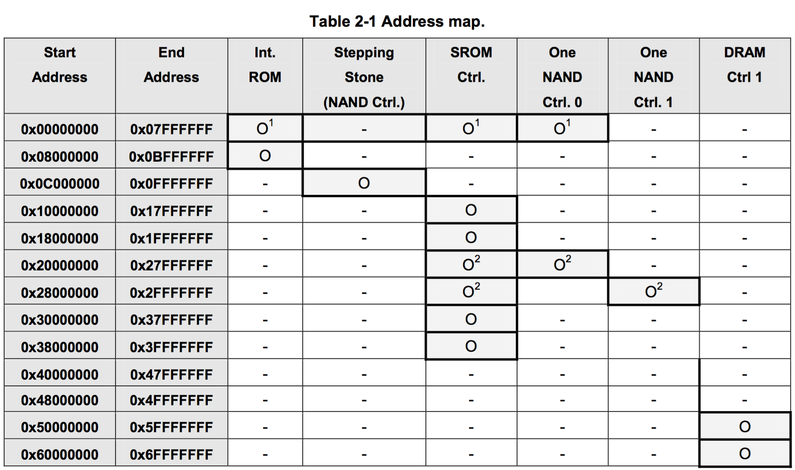
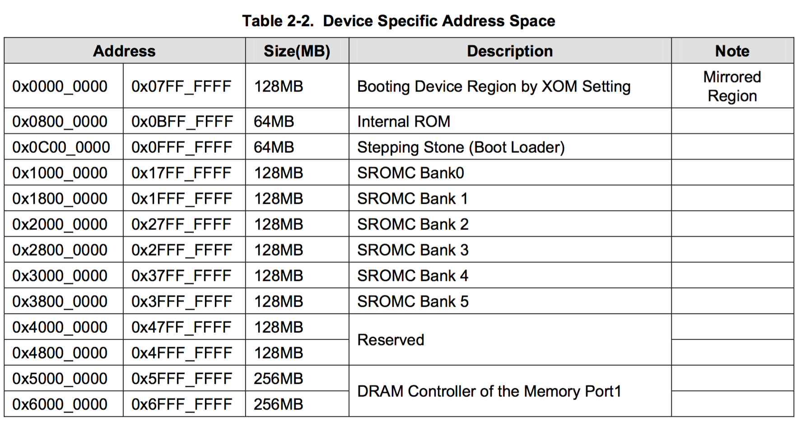

MemoryMap
====

**参考<S3C6410X.pdf> - 02-MEMORY MAP**

###Table 2-1 Address map.

**S3C6410X支持32位的物理地址，这些地址域可以被分为两个部分，一个部分用于存储(Memory, 地址范围0x0000_0000 ~ 0x6FFF_FFFF)，另外一个用于外设(Pheriperal, 地址范围0x7000_0000 ~ 0x7FFF_FFFF)。**     
**系统通过SPINE总线访问Memory空间，通过PERI总线访问Pheriperal空间。而为了适应不同外设的访问速度，又分别通过AHB总线访问LCD、Camera、Accelerator等高速外设，通过APB总线访问iic、watchdog等低速外设。**

加粗线的框表示了可映射的地址范围。     
备注：    

1. 粗框中上标为1的，表示0x0000_0000 ~ 0x07FF_FFFF的128MB地址，根据OM寄存器的配置而决定，在04-MemorySubSystem章节中有详细讲解。
2. 粗框中上标为2的，表示其地址映射可以由SROM Controller / One NAND Controller分配。代表这个地址可以同时被映射到SROM控制器和OneNAND控制器。详细的信息也在存储子系统这一节中介绍。
3. 6410X PoP A类型的不支持NAND Flash。所以此时我们可以忽略掉NAND Flash控制器这一列。6410X PoP D类型的不支持OneNANF Flash控制器，此时可以忽略OneNAND Flash控制器这一列，这样就不会冲突了。

#####Memory空间:

* 引导镜像区 
* 内部存储区
* 静态存储区
* 动态存储区

----

1. 0x0000_0000 ~ 0x07FF_FFFF(128MB)    
	**Booting Device Region by XOM Setting，引导镜像区。**       
	引导镜像区，物理地址为0x0000_0000~0x07FF_FFFF，共128MB，是用来启动系统的。但是这个范围内并没有实际的存储介质与之对应，只能在通过寄存器OM[4:0]选择具体的启动介质，再把相应介质的物理地址映射到这个启动区，比如说选择了IROM 启动方式后，就把IROM所占的地址空间映射为0x00000000开始的空间。    
2. 0x0800_0000 ~ 0x0BFF_FFFF (64MB)     
	**Intelnal ROM，内部ROM区。**     
	一般并不会占用这么大的地址空间，实际存储介质只有32KB，一个只读区，放的是IROM方式下的启动代码，选择IROM启动的时候首先运行的代码就是这一部分，称为BL0，这部分代码由厂家固化。
3. 0xC000_0000 ~ 0x0FFF_FFFF (64MB)    
	**Stepping Stone(Boot Loader)，内部SRAM区。**        
	S3C6410的Stepping Stone只有8K SDRAM。
	可读可写，当配置为NAND闪存启动时，Stepping Stone将映射到引导镜像区，并有BL0的程序负责拷贝NAND Flash的前8K数据到Stepping Stone中。   
4. 0x1000_0000 ~ 0x17FF_FFFF (128MB)
5. 0x1800_0000 ~ 0x1FFF_FFFF (128MB)
6. 0x2000_0000 ~ 0x27FF_FFFF (128MB)      
	从0x1000_0000开始，到0x3FFF_FFFF结束，每128MB划分为一个块(**SROMC Bank 0/1/2/3/4/5，静态存储区**)，共6*128MB。    
	这个区域用于访问挂在外部总线上的设备，比如说SRAM、NOR flash、oneNand等。这个区域被分割为6个bank，每个bank为128MB，数据宽度最大支持16bit，每个bank通过 Xm0CS[5:0]来划定。
7. 0x5000_0000 ~ 0x5FFF_FFFF (256MB)
8. 0x6000_0000 ~ 0x6FFF_FFFF (256MB)     
	两个256MB地址空间（**动态存储区**），映射到DRAM Controller中，可以通过DMC的Xm1CS[1:0]来进行着2个区间的选择。这个内存区主要是扩展DRAM，最大可以扩展512MB的DRAM。    
	其中，Friendly ARM - Tiny6410使用的存储介质为256MB Mobile SDRAM，其地址空间为0x5000_0000 ~ 0x5FFF_FFFF;可以从程序中看到，链接地址都是0x5000_0000;
9. 0x7000_0000 ~ 0x7FFF_FFFF (128MB)   
	Pheriperal外设区域，通过PERI 总线被访问。    
	这个地址范围的所有的SFR能被访问。而且如果数据需要从NFCON或CFCON传输，这些数据需要通过PERI总线传输。
	

	

###Table 2-2. Device Specific Address Space

* Booting Device Region by XOM Setting
* Internal ROM    
	S3C6410中的IROM，CPU上电后先执行IROM的程序（初始化、从启动设备中读取前8K数据到Stepping Stone、跳转到Stepping Stone执行程序）
* Stepping Stone(Boot Loader)    
	0x0C00_0000 ~ 0x0FFF_FFFF (128MB)    
	
		// 将Stepping Stone的8K SDRAM空间作为栈
		// 指向栈顶，栈从高地址开始，压栈后地址递减。
		ldr sp, =0x0c002000 //栈可用空间: 0x0c002000 ~ 0x0c000000;
		
* SROMC Bank n    
* DRAM Controller of Memory Port 1     
	0x5000_0000 ~ 0x5FFF_FFFF (256MB)    
	0x6000_0000 ~ 0x6FFF_FFFF (256MB)    
	Friendly ARM - Tiny6410使用DRAM Controller驱动Mobile SDRAM芯片。因此其内存对应的其实地址为0x5000_0000;
	* 程序的Makefile文件中，指定链接地址:
		
			arm-linux-ld -Ttext 0x50000000 -o led.elf $^
	* 在链接脚本中，配置地址为0x5000_0000;
	
	