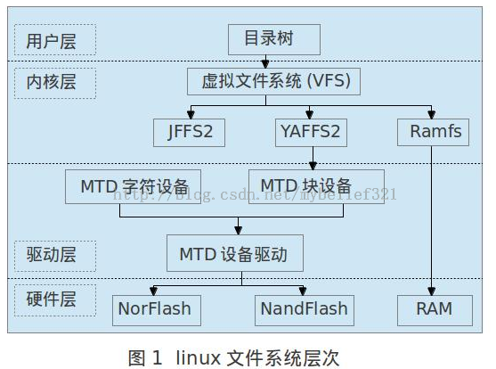

构建根文件系统
====

BusyBox版本：busybox-1.17.2（busybox-1.17.2-20101120.tgz）
(也可从官方网站下载，wget http://busybox.net/downloads/busybox-1.24.1.tar.bz2)    

yaffs制作工具：mkyaffsimage
yaffs2制作工具:mkyaffs2image（适合64M）、mkyaffs2image-128（适合128M以上）   
注意：制作工具用错会导致内核无法挂载文件系统，因此在制作映像前最好通过NFS先挂载根文件系统进行测试。

参考书籍: <嵌入式Linux应用开发完全手册> - 韦东山    
参考博客: http://blog.csdn.net/mybelief321/article/details/9995199

----

###根文件系统

**文件系统简单的说就是一种目录结构**，由于linux操作系统的设备在系统中是以文件的形式存在（linux的特点: Everything is a File），**将这些文件分类管理以及提供和内核交互的接口，就形成了一定的目录结构也就是文件系统。**文件系统是为用户反映系统的一种形式，为用户提供一个检测控制系统的接口。

而根文件系统，就是一种特殊的文件系统。那么根文件系统和普通的文件系统有什么区别呢？**根文件系统就是内核启动时挂载的第一个**（第一个的意思就是说要挂载的文件系统可能不止一个吧）**文件系统**。

由于根文件系统是启动时挂载的第一个文件系统，那么根文件系统就要包括Linux启动时所必须的目录和关键性的文件，例如Linux 启动时都需要有用户进程 init 对应的文件，在Linux挂载分区时一定要会找 /etc/fstab这个挂载文件等，根文件系统中还包括了许多的应用程序，如 /bin目录下的命令等。

任何Linux启动时所必须的文件的文件系统都可以称为根文件系统。

Linux支持多种文件系统，如包括 ext2、ext3、vfat、jffs、ramfs、yaffs 和nfs等，为了对各类文件系统进行统一管理，Linux引入了虚拟文件系统 VFS（可别小看这个VFS，它可是解决了linux启动时的“鸡生蛋，蛋生鸡”的问题呢），为各类文件系统提供一个统一的操作界面和应用程序接口。下图为Linux文件系统层次关系图

###Yaffs 文件系统
   **YAFFS(Yet Another Flash File System)文件系统是专门为Nand Flash设计的文件系统。**    
   
与JFFS/JFFS2文件系统有些类似，不同之处是JFFS/JFFS2 文件系统是专门为Nor Flash的应用场合设计的，而Nor Flash和Nand Flash本质上有较大的区别（坏块、备用区、容量），所以尽管 JFFS/JFFS2文件系统也能用与Nand Flash，但对于Nand Flash来说，通常不是最优方案（性能较低，启动速度稍慢）。而YAFFS利用 NandFlash提供的每个页面16字节或64字节的Spare区（OOB备用区）空间来存放ECC和文件系统的组织信息，能够实现错误检测和坏块处理。这样的设计充分考虑了NandFlash以页面为存取单元的特点，将文件组织成固定大小的数据段，能够提高文件系统的加载速度。    

   YAFFS目前有yaffs、yaffs2两个版本，一般来说，yaffs对小页面(512B+16B/页)的NandFlash(68M)有很好的支持，**yaffs2对更大的页面(2K+64B/页)的NandFlash(128M、256M或者更大)支持更好**。

yaffs和yaffs2区别：基本的制作过程是一样的，不一样的只是最后生成这两个版本的工具不一样, yafffs由mkyaffsimage生成，而yaffs2由mkyaffs2image生成。
另外FriendlyARM提供了mkyaffs2image(用于64M Nand Flash) 和 mkyaffs2image-128M(用于128M 以及更大的Nand Flash).

###Linux 根文件系统目录结构
   为了在安装软件时能够预知文件、目录的位置，为了让用户方便地找到不同类型的文件，在构造文件系统时，建议遵循**FHS标准（File Hierarchy Standard，文件系统层次标准）**。它定义了文件系统中目录、文件分类存放的原则，定义了系统运行时所需的最小文件、目录的集合，并列举了不遵循这些原则的例外情况及其原因。FHS并不是一个强制的标准，但是大多的Linux、Unix发行版本都遵循FHS。

1、/bin 目录    
   该目录下存放所有用户（包括系统管理员和一般用户）都可以使用的基本的命令。如cat、chgrp、chmod、cp、ls、sh、kill、mount等。

2、/sbin目录    
    该目录下存放系统命令，即只有管理员能够使用的命令、系统命令还可以存放在/usr/sbin、/usr/local/sbin目录下。    
/sbin 目录中存放的是基本的系统命令，它们用于启动系统、修复系统等，与/bin目录相似，在挂接其他文件系统之前就可以使用 /sbin。/sbin目录下常用的命令有：shutdown、reboot、fdisk、fsck等。不是急迫需要使用的命令存放在/usr/sbin目录下。本地安装的（Locally-installed）的系统命令存放在/usr/local/sbin目录下。

3、/dev 目录     
   该目录下存放的是设备文件。设备文件是Linux中特有的文件类型，在Linux系统下，以文件的方式访问各种外设，即通过读写某个设备文件操作某个具体硬件。
比如通过“/dev/ttySAC0”文件可以操作串口0，通过“/dev/mtdblock1”可以访问MTD设备（NAND Flash、Nor Flash等）的第2个分区等。

设备文件有两种：字符设备和块设备。设备文件可以使用mknod命令创建，    
如:  
`$ sudo mknod consule c 5 1`    
`$ sudo mknod null c 1 3`     
创建两个设备节点, 设备consule是一个字符设备(c: 字符设备, b: 块设备), 主设备号为5, 次设备号为1; 设备null是一个字符设备, 主设备号为1, 次设备号为3。

/dev中设备节点的创建方法:

* 手动创建    	
	mknod命令.     
	缺点: 不够灵活, 没有手动建立的设备不能使用, 例如新插的U盘。    
* 使用devfs文件系统(已过时, 这里忽略)     
* udev / mdev(推荐)    
	udev 是个用户程序（u是指user space，dev是指device），它能够根据系统中硬件设备的状态更新设备文件，包括设备文件的创建、删除等。     
	使用udev机制也不需要在/dev 目录下创建设备节点，它需要一些用户程序的支持，并且内核要支持sysfs文件系统。它的操作相对复杂，但是灵活性很高。    
	在 BusyBox中有一个mdev命令（注意，是命令哦），它是udev命令的简化版本。适合于嵌入式的应用埸合。其具有使用简单的特点。它的作用，就是在系统启动和热插拔或动态加载驱动程序时，自动产生驱动程序所需的节点文件。在以busybox为基础构建嵌入式linux的根文件系统时，使用它是最优的选择。我接下来的创建根文件系统会用这种方法。    

----

###BusyBox简介
   BusyBox是一个遵循 GPLv2协议的开源项目。有人将BusyBox比喻成Linux工具的瑞士军刀，简单的说就是Linux的一个大的工具集，包括了Linux中的大部分命令和工具。     
BusyBox中各种命令与相应的 GNU工具相比，所能提供的选项较少，但是能够满足一般应用, 占用的空间也很少。因此，BusyBox主要是为各种小型设备或者嵌入式系统提供。     
嵌入式根目录下的bin，sbin和usr目录中的命令以及启动程序linuxrc通常就是通过BusyBox产生的。BusyBox产生的。BusyBox会根据配置的不同自动生成一些文件，但是有些根文件系统下的文件还是需要用户自己建立。    

源码可以从http://www.busybox.net/download/下载。    

这里使用busybox-1.13.3.tar.bz2.   

搭建yaffs2根文件系统步骤:

1. 解压BusyBox文件并进行配置。(假设解压在/home/gxp 目录下。)

		tar -xzvf busybox-1.13.3.tar.gz
		cd busybox-1.13.3/
		make menuconfig

	(make menuconfig需要用到ncurses库，否则运行除错）
	
		sudo apt-get install libncurses5-dev

2. 常用的一些配置。

		Busybox Settings  --->
   			Busybox Library Tuning  --->
      			[*]   Fancy shell prompts
	选择Facncy Shell prompts一项，这可以使我们在profile这个文件中设置的命令提示符PS1中的转义字符生效

		Busybox Settings  --->
    		Build Options  --->
             [ ] Build BusyBox as a static binary (no shared libs)
	取消选择, 即表示使用动态链接。(则在后面构件Linux根文件系统时，需要在/lib/中添加glibc库文件。busybox需要此库文件。)

		Busybox Settings  --->
    		Build Options  --->
        		()  Cross Compiler prefix
	进入Cross Compiler prefix中编辑交叉编译工具前缀为arm-linux- 。

	剩下基本按照默认配置即可。

3. 图形配置完成以后, 将写入当前目录的.config文件中。

4. 配置顶层目录的Makefile.
	将其中的架构(ARCH) 设置为arm, CROSS_COMPILE设为arm-linux- ：
	
		ARCH ?= arm
		CROSS_COMPILE ?= arm-linux-

5. 输入make进行编译。

6. 安装编译好的busybox至指定目录(不指定将默认安装至当前系统中去, 由于我们编译的是ARM架构的, 自然不能使用。这里将其安装到我们要做的根文件系统目录中。假设是/home/gxp/rootfs.)

		$ mkdir /home/gxp/rootfs
		$ cd busybox-1.13.3/
		$ make CONFIG_PREFIX=/home/gxp/rootfs install

7. 安装完成以后, 就可以看到rootfs目录下有
bin/ , linuxrc, sbin/, usr/ 这几个文件。
其中所有的命令都是链接指向/bin/busybox的。

8. 安装执行这些命令所需要的动态链接库。

	busybox所需要的库文件, 就是编译busybox的交叉编译工具所含的库文件(arm-linux-gcc/lib/)。

	这里假设是arm-linux-gcc工具链。
	其实这个目录下的文件并非都属于glibc库，比如crt1.o、libstdc++.a等文件是gcc工具本身生成的。里面的目录、文件可以分为8类。

	①  加载器ld-2.3.6.so、ld-linux.so.2。    
    动态程序启动前，它们都被用来加载动态库。       
	②  目标文件（.o）。    
    比如crt1.o、crti.o、crtn.o、Mctr1.o、Scrt1.o等，在生成应用程序时，这些文件像一般的目标文件一样被链接。    
	③  静态库文件（.a）。    
    比如静态数学库libm.a、静态c++库libstdc++.a等，编译静态程序时会连接它们     
	④  动态库文件（.so、,so.[0-9]*）。    
    比如动态数学库libm.so、动态c++库libstdc++.so等，它们可能是一个链接文件。编译动态库时会用到这些文件，但是不会连接它们，运行时才连接。    
	⑤  libtool库文件（.la）。    
    在连接库文件时，这些文件会被用到，比如它们列出了当前库文件所依赖的其他库文件。程序运行时无需这些文件。     
	⑥  gconv目录。    
    里面是有头字符的集的动态库，比如ISO8859-1.so、GB18010.so等。    
	⑦  ldscripts目录。    
   里面是各种连接脚本，在编译应用程序时，它们被用于制定程序的运行地址、各段的位置等。    
	⑧  其他目录及文件。    

	在rootfs中创建lib文件夹，用来存放咱们的加载器和动态库。

		$ cd /home/gxp/tool/arm-linux-gcc/
		$ cd arm-none-linux-gnueabi/lib/
		$ mkdir -p /home/gxp/rootfs/lib/
		$ cp *.so* /home/gxp/rootfs/lib/

	注意: 这里如果没有拷贝busybox所必须的一些库文件至根文件目录, 则开发板挂载根文件系统后执行init会出现错误.其实，上面复制的库文件不是每个文件都会被用到，可以根据应用程序对库的依赖关系保留需要用到的。通过ldd命令可以查看一个应用程序会用到哪些库。

9. 创建rootfs目录下的etc目录

		$ cd /home/gxp/rootfs
		$ mkdir etc
		$ touch mdev.conf

	其中mdev.conf是udev的简化版本, 用于嵌入式中支持一些热插拔设备, 这里默认为空即可。需要在busybox的menuconfig中配置相应选项。(busybox默认添加mdev支持)

		$ vim inittab

	在启动过程中bootloader会传递参数init=/linuxrc给内核的main()函数，所以在文件系统被挂载后，运行的第一个程序是linuxrc，而linuxrc是一个指向/bin/busybox的链接文件，也就是说文件系统被挂在后运行的第一个程序是busybox。
Busybox首先会解析文件/etc/inittab，这个文件中存放的是系统的配置信息，这些配置信息指明了接下来将要启动那些程序。

	inittab文件内容如下:

		#/etc/inittab
		::sysinit:/etc/init.d/rcS
		s3c2410_serial0::askfirst:-/bin/sh
		::ctrlaltdel:/sbin/reboot
		::shutdown:/bin/umount -a -r

 	/etc/inittab 文件中每个条目用来定义一个子进程，并确定它的启动方法，格式如下

		<id>:<runlevels>:<action>:<process>

	- id:表示这个进程要使用的控制台（即标准输入、标准输出、标准错误设备）。如果省 略，则使用与init进程一样的控制台。
	- runlevels:对于Busybox init程序，这个字段滑意义，可以省略。
	- action:表示init程序如何控制这个子进程，
	- process: 要执行的程序，它可以是可执行程序，也可以是脚本

	文件etc/inittab配置条目说明如下：
	
	1. ::sysinit:/etc/init.d/rcS    
	启动系统初始化文件/etc/init.d/rcS。字段sysinit表明文件/etc/init.d/rcS在系统启动后最先执行，并且只执行一次，init进程等待它结束才继续执行其它动作。（脚本文件名一般为rc，后缀S代表单用户运行级别脚本） 
	2. s3c2410_serial0::askfirst:-/bin/sh   
	在串口s3c2410_serial0上启动askfirst动作的shell。S3C2410的串口名在/dev下是s3c2410_serialx。在mini2440移植内核时定义的串口名为s3c2410_serial0。需要注意的是，开发板上通过mdev生成的/dev目录中，S3C2410、S3C2440的串口名是s3c2410_serial0、s3c2410_serial1、s3c2410_serial2,不是 ttySAC0、ttySAC1、ttySAC2。当静态创建设备文件时，这里要将s3c2410_serial0 修改为 ttySAC0 。askfirst表明init进程先输出“Please press Enter to actvie this console”，等用户输入回车键之后才启动-/bin/sh。      
	3. ::ctrlaltdel:/sbin/reboot  当按下Ctrl+Alt+Delete组合键时，init重启执行程序。字段ctrlaltdel表明当按下Ctrl+Alt+Delete组合键时，执行相应的进程。    
	4. ::shutdown:/bin/umount -a -r   告诉init在关机时运行umount命令卸载所有的文件系统，如果卸载失败，试图以只读方式重新挂载。字段shutdown表明在重启关闭系统命令时执行相应进程。   
	
	当解析完文件etc/inittab后就将启动这些进程，首先要执行的是启动脚本etc/init.d/rcS。

		$ mkdir init.d    
		$ cd init.d/   
		$ touch rcS    
		$ sudo chmod a+x rcS
		$ vim rcS
		
	rcS文件内容如下

		#!/bin/sh
		PATH=/sbin:/bin:/usr/sbin:/usr/bin
		runlevel=S
		prevlevel=N
		umask 022
		export PATH runlevel prevlevel
		mount -a
		echo /sbin/mdev>/proc/sys/kernel/hotplug
		mdev -s
	
	详解：

		#!/bin/sh    #用busybox的shell
	
	PATH=/sbin:/bin:/usr/sbin:/usr/bin  #shell命令的搜索路径    

	runlevel=S   #运行在单用户模式    
	
	prevlevel=N  #前一个级别，为N则表示没有前一个级别    
	
	umask 022   #权限位掩码

	export PATH runlevel prevlevel   #将环境的变量导出到环境中

	mount -a   #将文件 /etc/fstab 中指明的文件挂载到对应的挂载点上

	echo /sbin/mdev>/proc/sys/kernel/hotplug     
		#当有热插拔事件产生时， 内核就会调用位于/sbin目录的 mdev。 这时 mdev通过环境变量中的 ACTION 和 DEVPATH，（这两个变量是系统自带的）来确定此次热插拔事件的动作以及影响了/sys 中的那个目录。接着会看看这个目录中是否有“dev”的属性文件，如果有就利用这些信息为 这个设备在/dev 下创建设备节点文件。

	mdev -s   #建立dev目录。以‘-s’为参数调用位于/sbin 目录写的 mdev（其实是个链接，作用是传递参数给/bin目录下的busybox 程序并调用它） ，mdev扫描 /sys/class和/sys/block中所有的类设备目录，如果在目录中含有名为“dev”的文件，且文件中包含的是设备号，则 mdev 就利用这些信息为这个设备在/dev下创建设备节点文件。一般只在启动时才执行一次  “mdev -s” 。

	创建fstab文件:
	
		$ cd /home/gxp/rootfs/etc
		$ vim fstab

  fstab文件内容如下
  
		#device   mount-point     type      option     dump   fsck   order
		proc        /proc     proc     defaults    0        0
		tmpfs        /tmp     tmpfs    defaults    0        0
		sysfs       /sys      sysfs    defaults    0        0
		tmpfs        /dev      tmpfs    defaults    0        0

10. 创建rootfs目录下的dev目录

		$ cd /home/gxp/rootfs
		$ mkdir dev
		$ sudo mknod console c 5 1
		$ sudo mknod null c 1 3

	因为mdev是通过init进程来启动的，在使用mdev构造 /dev 目录之前，init 进程至少要用到设备文件 /dev/console、/dev/null，所以要建立这两个设备文件。

11. 创建rootfs目录下的其他剩余空目录

		$ cd /home/gxp/rootfs
		$ mkdir proc mnt tmp sys root home
		
	这样就得到一个非常小的根文件系统了。就差最后的制作工具操作了。

12. 使用mkyaffs2image-128M制作可以烧入Nand Flash的文件。

		$ cd /home/gxp/
		$ mkyaffs2image-128M rootfs/ rootfs.yaffs2

	这样就得到了可以烧写进Nand Flash的镜像文件rootfs.yaffs2。     
	其中mkyaffs2image是从网上下载, 已安装至/usr/bin中，可直接使用的命令。

13. U-boot中烧写yaffs2镜像    

		[u-boot@MINI2440]# tftp 0x30008000 rootfs.yaffs2
		# nand erase 0x580000 7a80000
		# nand write.yaffs 0x30008000 0x580000 dbb040

14. 设置内核参数

		setenv bootargs "noinitrd root=/dev/mtdblock2 rootfstyle=yaffs2 console=ttySAC0,115200 init=/linuxrc mem=64M”
		setenv bootcmd "nand read 0x30008000 0x80000 0x500000;bootm 0x30008000"
		saveenv

15. 其他配置

	添加etc/profile文件。

		ulimit -S -c 0 > /dev/null 2>&1
		USER="`id -un`"
		LOGNAME=$USER
		PS1='[\u@\h\W]# '
		PATH=$PATH
		HOSTNAME=`/bin/hostname`
		export USER LOGNAME PS1 PATH

	ulimit -S -c 0 > /dev/null 2>&1  
	//首先  ulimit -S -c 0   是ulimit命令   
	-c选项：设置core文件的最大值,单位:blocks,就是段错误时产生的core文件，后面加文件大小。   
	后面加上0,就是设置段错误不产生core文件。   
	然后  > /dev/null  的意思就是ulimit输出的结果保存到/dev/null文件，而这个文件是系统的一个文件，它不保存任何信息。所以如果有不想的输出数据，重定向到这个文件就可以了，这时，标准输出（文件句柄1）是指向这个文件。    
	最后，2>&1 的意思就是标准错误（文件名柄）复制文件句柄为1的地方，也就是/dev/null。所以，这句的意思，就是设置core文件大小为0，然后输出信息以及错误信息都不输出在>显示器上。

	USER="`id -un`"   
	//id-un与whoami命令有相同的功能，获取当前的用户名。

	LOGNAME=$USER  
	//LOGNAME表示当前的用户名，也就是命令提示符中
	[root@wws]#、[guest@wws]#中的root和guest字样。

	PS1='[\u@\h\W]# '    
	//Linux系统提示符是用系统变量PS1来定义的。一般系统默认的形式是：[username@hostname 工作目录]$。    
	其中，\u 表示当前用户名，\h表示运行shell的计算机名，\W表示当前的工作目录名，更多PS1的信息请百谷。    

	PATH=$PATH   //获得当前的环境变量。
	
	HOSTNAME=`/bin/hostname`    
	//获得当前的主机名，这里/bin/hostname是一个命令
	
	export USER LOGNAME PS1 PATH     
	//导出变量符号。注意：/etc/profile定义的变量是全局的，即对所有登录的Linux用户都有效。而在普通脚本里eport只在当前脚本以及子进程里有效。
	

	添加etc/hostname，填入自定义的名称。

	添加etc/group文件：

		root:*:0:
		daemon:*:1:
		bin:*:2:
		sys:*:3:
		adm:*:4:
		tty:*:5:
		disk:*:6:
		lp:*:7:lp
		mail:*:8:
		news:*:9:
		uucp:*:10:
		proxy:*:13:
		kmem:*:15:
		dialout:*:20:
		fax:*:21:
		voice:*:22:
		cdrom:*:24:
		floppy:*:25:
		tape:*:26:
		sudo:*:27:
		audio:*:29:
		ppp:x:99:

	添加etc/passwd文件:
	
		root::0:0:root:/root:/bin/sh

	添加etc/shadow文件, 为空即可。

----

###错误处理

开发板上电, 串口输出错误信息：

	Kernel panic - not syncing: No init found.  Try passing init= option to kernel.

首先能出现让人激动的的控制台，那么系统移植已经接近完成；但是不少人在最后一步出现问题。     
要点如下：

1. 在正确的位置烧写正确格式的文件系统映象：
2. 内核支持这种文件系统格式
3. 文件系统的内容要完备

详细排错:

**在正确的位置烧写正确的文件系统映象**：    
(a). 正确的位置    
嵌入式中常通过bootloader烧写文件系统映象，假设写在flash的地址A处。    
内核启动时，显然要从地址A处读取文件系统，内核是怎么知道的呢？通过命令行参数，比如“root=/dev/mtdblock2”。   
/dev/mtdblock2 又是怎么和地址A对应上的呢？   
内核将flash划分为几个分区，这是在代码中固定的。/dev/mtdblock2是第3个分区，它的开始地址必须是A。
在内核启动时，可以看到这些分区的开始地址、结束地址，比如内核启动时会有类似下面的信息：

	Creating 3 MTD partitions on "NAND 64MiB 3,3V 8-bit":
	0x00000000-0x00030000 : "bootloader"
	0x00050000-0x00250000 : "kernel"
	0x00250000-0x03ffc000 : "root"
	
对于上面的内核信息，/dev/mtdblock2对应root分区，开始地址为0x00250000，使用bootloader写文件系统映象时，烧写的地址必须是0x00250000.

所以，要保证3点：

1. bootloader烧到地址A
2. 地址A是内核某个分区的开始地址
3. 命令行参数“root=/dev/mtdblockXXX ”是这个分区

(b). 正确格式的文件系统映象    
不同的bootloader支持的烧写的文件系统映象格式不同、使用的烧写命令也可能不同，请注意这点。
另外，制作文件系统映象时，使用的工具也不要弄错了。    
最后，请保证这个文件系统映象是“真的烧写了”，因为如果flash只是擦除而没有烧写，它也是“正确的、可以挂接的文件系统”。    

**内核支持这种文件系统格式**     
配置内核时选上要支持的文件系统格式    

1、2这两个问题如果不能保证，内核启动时会出现类似如下错误：

	VFS: Cannot open root device "mtdblock2" or unknown-block(2,0)
	Please append a correct "root=" boot option

如果1、2能保证，就可以挂接上文件系统，出现类似下面的字样时，革命已经成功了80％： 

	VFS: Mounted root (cramfs filesystem) readonly.
	Freeing init memory: 116K

**文件系统的内容要完备**    

挂接文件系统后，内核就会读取、执行文件系统中的某个文件，通过它来启动应用程序。这个文件要么通过命令行参数“init=xxxx”来指定，要么取默认的文件(下面说明)。

一般制作文件系统映象时，都是在一个目录（假设目录名为rootfs）下放好各种东西：bin/，sbin/，lib/等目录，etc/fstab等文件，然后将这个目录制作为文件系统映象。

可以想象，如果这个目录中的东西不对、不全，即使制作出了文件系统映象，也只是能识别出来，挂接上去；但是启动不了──所谓启动，不就是执行文件系统中的程序嘛？   

这时会有类似以下的错误：    

	Failed to execute /linuxrc.  Attempting defaults...
	Kernel panic - not syncing: No init found.  Try passing init= option to kernel.

它说得很明显，"Failed to execute /linuxrc"，执行/linuxrc失败：     
它为什么要执行/linuxrc，还不是因为你在命令行中加入了“init=/linuxrc”这个参数。      

它为什么会失败？     
原因有二：   

* 你制作文件系统映象时，rootfs目录下有linuxrc这个文件吗？
* rootfs目录的linuxrc文件是正确的吗？

请好好确定这两点，大多数是没有linuxrc文件──linuxrc是busybox自动生成的，只要配置好就可以。    
如果有linuxrc，那么就是它无法执行了(解决方法在下面)。    

不用linuxrc行不行？当然行！看看内核文件init/main.c，有如下字样：

	run_init_process("/sbin/init");
	run_init_process("/etc/init");
	run_init_process("/bin/init");
	run_init_process("/bin/sh");
	panic("No init found.  Try passing init= option to kernel.");
	
它会依次尝试执行/sbin/init、/etc/init、/bin/init、/bin/sh这些文件，都失败后才打印出错信息"No init found.  Try passing init= option to kernel."。   

所以，出现这个出错信息时，就表明了没有或是无法执行这些文件：命令行参数“init=xxxx”来指定的xxx文件、/sbin/init、/etc/init、/bin/init、/bin/sh。    

* 请检查你的rootfs目录，看看这点些文件是否存在
* 使用file命令看看它们是什么文件类型，是否可执行。

---