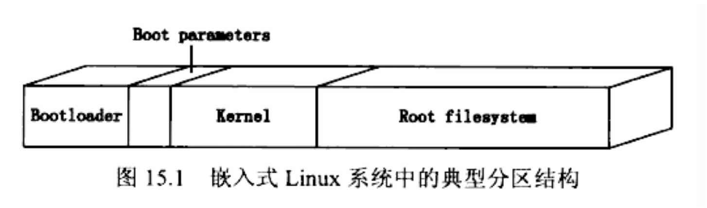

MTD
=======

Friendly ARM提供的内核 linux-2.6.38:

linux-2.6.38/arch/arm/mach-s3c64xx/mach-mini6410.c

    /* Nand flash */
    struct mtd_partition mini6410_nand_part[] = {
        {
            .name       = "Bootloader",
            .offset     = 0,
            .size       = (4 * 128 *SZ_1K),
            .mask_flags = MTD_CAP_NANDFLASH,
        },
        {
            .name       = "Kernel",
            .offset     = (4 * 128 *SZ_1K),
            .size       = (5*SZ_1M) ,
            .mask_flags = MTD_CAP_NANDFLASH,
        },
        {
            .name       = "File System",
            .offset     = MTDPART_OFS_APPEND,
            .size       = MTDPART_SIZ_FULL,
        }
    };
   
###Nand Flash布局（1024M空间):
 
1. Bootloader, 0x0 ~ 0x80000, 512K;
2. Kernel, 0x80000 ~ 0x580000, 5M;
3. File System, 0x580000 ~ 0x40000000, (1018.5M)

###ARM板子的MTD输出:

	[root@FriendlyARM /]# uname -a
	Linux FriendlyARM 2.6.38-FriendlyARM #15 PREEMPT Tue Oct 14 16:02:12 CST 2014 armv6l unknown
	[root@FriendlyARM /]# cat /proc/mtd
	dev:    size   erasesize  name
	mtd0: 00080000 00020000 "Bootloader"
	mtd1: 00500000 00020000 "Kernel"
	mtd2: 3fa80000 00020000 "File System"

使用FriendlyARM提供的bootloader(SuperBoot-6410.bin),下载Bootloader会下载到Nand Flash开头的512K空间，下载内核是会下载到0x80000开头的5M空间，下载文件系统会下载到0x580000开头的空间。

###`cat /proc/partitions`
ARM板子的`cat /proc/partitions`输出:

	major minor  #blocks  name
	31        0        512 mtdblock0
	31        1       5120 mtdblock1
	31        2    1042944 mtdblock2
	179        0     123904 mmcblk0
	179        1     122880 mmcblk0p1

###`ls -l /dev/mtd*`

	[root@FriendlyARM]# ls -l /dev/mtd*
	brw-rw----    1 root     root       90,   0 Jun  1 17:16 /dev/mtd0
	crw-rw----    1 root     root       90,   1 Jun  1 17:16 /dev/mtd0ro
	brw-rw----    1 root     root       90,   2 Jun  1 17:16 /dev/mtd1
	crw-rw----    1 root     root       90,   3 Jun  1 17:16 /dev/mtd1ro
	brw-rw----    1 root     root       90,   4 Jun  1 17:16 /dev/mtd2
	crw-rw----    1 root     root       90,   5 Jun  1 17:16 /dev/mtd2ro
	brw-rw----    1 root     root       31,   0 Jun  1 17:16 /dev/mtdblock0
	brw-rw----    1 root     root       31,   1 Jun  1 17:16 /dev/mtdblock1
	brw-rw----    1 root     root       31,   2 Jun  1 17:16 /dev/mtdblock2

nand flash在linux的mtd分区中，为3个设备,

1. /dev/mtdblock0, "bootloader";
2. /dev/mtdblock1, "kernel";
3. /dev/mtdblock2, "filesystem";

sd卡在linux分区为两个设备:

	brw-rw----    1 root     root      179,   0 Jun  1 17:16 /dev/mmcblk0
	brw-rw----    1 root     root      179,   1 Jun  1 17:16 /dev/mmcblk0p1

1. /dev/mmcblk0, 整个SD卡
2. /dev/mmcblk0p1, SD卡的分区1, 不包括SD卡的前1024k(2048个扇区);

----

如果使用U-Boot引导Linux, 需要设置mtdparts变量：

`set bootargs “noinitrd console=ttySAC0 root=/dev/mtdblock3 rootfstype=jffs2 mtdparts=nand_flash:512k(u-boot)ro,5m(kernel),1042944k(root.jffs2)”`

且可以在之后的nand read/write/erase命令中直接使用分区的名字而无需指定绝对地址。 
