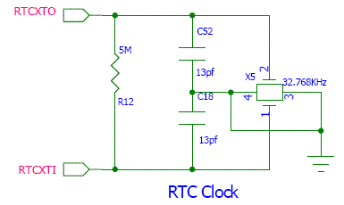
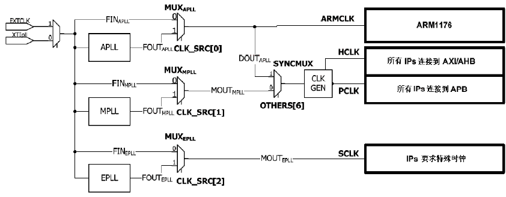
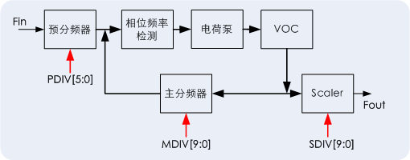

时钟管理
============

参考: [http://lli_njupt.0fees.net/ar01s18.html]

###时钟驱动

驱动数字电路运转是的时钟信号，它就像人的心脏一样，只有时钟的跳动，时序电路才会被驱动，完成计时，同步，计数等，而这些基本的电路跳变动作又被进一步组成更为复杂的计算电路：CPU。    
ARM CPU核是用时序信号来驱动的，而核心外的大多数子模块：内存控制电路，中断控制器等等同样是由时序信号来驱动的；另外大多数的外部设备也需要时序驱动：内存，磁盘控制器等等。只是它们的不同在于时序信号的频率。

在S3C6410 中生成所需的系统时钟信号，用于CPU 的ARMCLK, AXI/AHB 总线外设的HCLK和APB总线外设的PCLK。所以在S3C6410 中有三个PLL(锁相环电路)。为了进一步了解PLL的原理，先从最原始的时钟发生器晶振说起。

S3C6410:          

	system clock signals:          

		* ARMCLK - CPU
		* HCLK - AXI/AHB 总线外设(存储/中断/lcd等控制器)
		* PCLK - APB 总线外设(看门狗，定时器，SD等)

----

###外部时钟：晶振

晶振这种外部器件可以产生稳定的电流波形，是时钟信号的源头。

晶振是一块特定尺寸的高纯度石英晶体加一些电路的小器材，但是它只需要输入很小的电流就能持续输出稳定的时钟波形。

石英晶体有一个奇特的特性，如果给它施加电压，它就会产生机械振荡；反之，如果给它机械力，它又会产生电流，这种特性叫**压电效应**。    
更奇妙的是如在极板间所加的是交变电压，就会产生机械变形振动，同时机械变形振动又会产生交变电场。一般来说，这种机械振动的振幅是比较小的，其振动频率却是很稳定的。当外加交变电压的频率与晶片的固有频率（决定于晶片的尺寸）相等时，机械振动的幅度将急剧增加，这种现象称为压电谐振，因此石英晶振又称为石英晶体谐振器。其特点是频率稳定度很高。石英钟就是使用这个原理制而成。

**当晶片产生谐振，就会产生一个稳定的波幅显著的波形，只要持续的供电，这种电能到机械能再到电能的转换就会让波形不断生成**。在要求得到高稳定频率的电路中，必须使用石英晶体振荡电路。石英晶体具有高品质因数，振荡电路采用了恒温、 压等方式以后，振荡频率稳定度可以达到 10^(-9)至10^(-11)。可被广泛应用在通讯、时钟、手表、计算机需要高稳定信号的场合。

**晶振在数字电路的作用就是提供一个基准时间，或者是基本时序信号。**   
数字电路都是按时序的进行工作的，在某个时刻专门完成特定的任务,因此几乎每个电路都有会接收外部时钟信号的管脚，也即电路之间的处理需要同步的时序。如果这个时序信号发生混乱，整个电路就工作不正常了。 在一个整体设备里，如开发板,或 PC 主板，所有电路通常共享一个晶振，便于各部分保持同步。有些通讯系统的基频和射频使用不同的晶振，而通过电子调整频率的方法保持同步。

----

###内部时钟：系统主频

一般晶振称为外部时钟，它需要把信号引入数字电路给CPU和其它模块使用，**局限于材料的物理特性一般的晶振的频率并不是太高**，如S3C2440/S3C6410上的晶振的频率一般是12MHz/20MHz(**为了降低电磁干扰，降低板间布线要求**)，而对的应的CPU需要使用的时钟信号高达400MHz/600MHz，或者更高。此时，需要把较低的外部时钟信号增加频率到CPU可以接受的频率。这称为**倍频**。S3C6410的主频最高可到667Mhz.

倍频的功能是由一种特殊电路——锁相环电路来完成的。 **PLL锁相环电路(Phase-Locked Loop)基本上是一个闭环的反馈控制系统，它可以使PLL 的输出与一个参考信号保持固定的相位关系**。PLL在电路中的作用之一是起到倍频的作用：即可以输出系统时钟的固定倍数频率。所以这里它起到倍频器的作用。

因此，在ARM CPU启动后，最开始必须做的事情是配置倍频的比率。这样当外部时钟频率一定的情况下，按照倍频的比例,就可以得到CPU的频率，一个系统出于不同目的可能会以不同频率运行，低频运算速度慢但是省电，高频速度快但能耗大。所以可以调节倍频器的倍数来调节CPU的工作频率。但是CPU本身是有一个最高可以支持的频率，如果强行配置成高于该频率的速度运行，就是人们称的超频。有可能带加速CPU老化，运行时散热增加的问题。对于S3C6410来说，这个频率就是ARMCLK。

----

###内部时钟：设备频率

在SOC的CPU上，除了CPU内核以外，在一个物理芯片上,还有一些其它模块。以S3C6410为例,它带了I2C,UART,USB HOST等多个模块，这一些模块通过AHB总线与CPU内核相连。它们同样需要时钟信号来驱动。但是**ARM的主频信号ARMCLK相对这一些模块来说，显得过高。这个时候CPU内核会提供两种较低频率的时钟信号：HCLK和PCLK两种时钟信号给设备使用**。

**但是对一些低频模块，PCLK的频率仍然显得过高，这时需要模块自己使用分频器(divider)来把频率进一步降低。**降到多少值一般取决于软件的需求，因此各个模块的分频参数一般都是可以调整的。因此初始化相关模块时，软件做一件重要事件就是设置分频参数。

在有一些模块，如果需要编程来设定分频的比率，通常是用Prescaler即预分频因子这个参数来设定分频后的值，假设输入频率是Fin,分频后输出的频率是Fout, 而三者有如下关系:

	Fout = Fin /(Prescaler + 1 )

在某一些模块里，分频后的频率仍然是太高，可能需要再次分频，这时分频的参数一般称为divider value。这样公式变成
	
	Fout = Fin /(Prescaler + 1 )/divider 

参考 [S3C6410-Timer原理图-两级分频器](https://github.com/SeanXP/ARM-Tiny6410/tree/master/timer#timer-clock-tree-diagram)

倍频和分频的关系就像供电系统: 
   
* 晶振就是发电站，它通过PLL倍频后变成高压电，给CPU传输使用
* 而模块又使用分频器把高压电降下来给自己使用。

----

### S3C6410 - PLL 

参考: [S3C6410-PLL锁相环](https://github.com/SeanXP/ARM-Tiny6410/tree/master/clock/7.clock_c#pll锁相环)

S3C6410提供三种PLL:APLL(ARM PLL)，MPLL(Main PLL)和EPLL(Extra PLL)。

	1. ARMPLL, 用于ARMCLK (for CPU); 
	2. main PLL, 用于HCLK & PLK (AHB/APB总线设备);
	3. extra PLL, 用于外设 (供UART,IIS,IIC使用, especially for audio related clocks.); 

它们提高不同倍数来给不同模块来使用。理论上PLL可以倍频到1.6GHz.
		

S3C6410的时钟源可以使用外部晶振（XXTIpll），也可以使用外部时钟（XEXTCLK）两种方式输入时钟信号。它由跳线OM[0]决定，这一位为0，选择XXTIpll，否则选择XEXTCLK。通常会选择外部晶振。

图中的MUX为数据选择器（Multiplexer），指从多路输入信号中有选择性的选中某一路信号送到输出端的组合逻辑电路。图中均为为2选1数据选择器。CLK_SRC 寄存器的最低三位通过控制三组选择器来选择时钟源。当位为0时，则输入时钟绕过PLL电路。APLL的原理图如下所示，MPLL和EPLL原理与此类似。

* 预分频器(Pre-Divider)用来对输入的频率Fin进行预先分频，通常这个输入通过晶振XXTIpll来输入。
* 相位频率检测器(Phase Frequency Detector)用来检测输入时钟信号的相位和频率，它用来控制电荷泵产生对应的电压。
* 电荷泵(Cahre Pump)用来将输入频率和相位的变化转化为电压的变化。
* 压控振荡器VOC(Voltage Controlled Oscillator)用来实现电压到频率的转化。
* 主分频器(Main Divider)用来将输出的频率进行分频，并反馈到相位频率检测器的输入中，所以它起到了倍频的作用。
* 定位器(Scaler)将VOC输出的频率Fvco再次分频后输出Fout。

不同的分频器由不同的寄存器或者寄存器位来控制分频的除数，S3C6410提供了34个特殊功能寄存器SFR(Special Functional Register)来控制PLL，时钟发生器，电源管理部分和其他系统的参数。对于PLL来说有七个寄存器来配置它们：

[PLL寄存器](https://github.com/SeanXP/ARM-Tiny6410/blob/master/clock/7.clock_c/clock.c#L26)

	寄存器       地址     读/写       描述                   复位值
	APLL_LOCK 0x7E00_F000 读/写 控制PLL 锁定期APLL。    0x0000_FFFF
	MPLL_LOCK 0x7E00_F004 读/写 控制PLL 锁定期MPLL。    0x0000_FFFF
	EPLL_LOCK 0x7E00_F008 读/写 控制PLL 锁定期EPLL。    0x0000_FFFF
	APLL_CON  0x7E00_F00C 读/写 控制PLL 输出频率 APLL。 0x0190_0302
	MPLL_CON  0x7E00_F00C 读/写 控制PLL 输出频率 MPLL。 0x0214_0603
	EPLL_CON0 0x7E00_F00C 读/写 控制PLL 输出频率 EPLL。 0x0020_0102
	EPLL_CON1 0x7E00_F00C 读/写 控制PLL 输出频率 EPLL。 0x0000_9111	
	
从命名可以得知它们分别对应到APLL，MPLL和EPLL。对于APLL和MPLL，PDIV，MDIV和SDIV参数与Fin和Fout的关系有以下公式确定，而对于EPLL则还有其他分频器需要配置。

[Fout计算](https://github.com/SeanXP/ARM-Tiny6410/blob/master/clock/7.clock_c/clock.c#L43)

	Fout = MDIV * Fin / (PDIV * 2SDIV)
	这里，用于APLL 和MPLL 的 MDIV，PDIV，SDIV 必须符合以下条件：
	MDIV: 56 ≤ MDIV ≤ 1023
	PDIV: 1 ≤ PDIV ≤ 63
	SDIV: 0 ≤ SDIV ≤ 5
	FVCO (=MDIV X FIN / PDIV): 1000MHz ≤ FVCO ≤ 1600MHz
	FOUT: 31.25MHz ≤ FVCO ≤ 1600MHz
	
Uboot中提供了几类系统时钟的设定，比如设定ARMCLK为532，666等。如果选择了CONFIG_CLK_532_133_66，则意味着配置ARMCLK为532MHz，HCLK为133MHz，PCLK为66MHz。

	/* input clock of PLL */
	#define CONFIG_SYS_CLK_FREQ  12000000 /* the SMDK6400 has 12MHz input clock */

	#elif defined(CONFIG_CLK_532_133_66) /* FIN 12MHz, Fout 532MHz */
	#define APLL_MDIV       266
	#define APLL_PDIV       3
	#define APLL_SDIV       1
	#define CONFIG_SYNC_MODE
	
