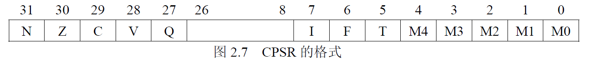
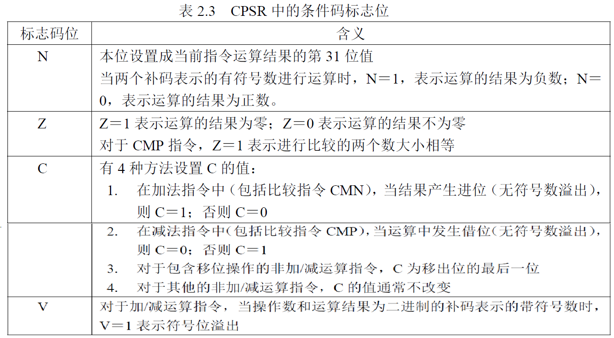
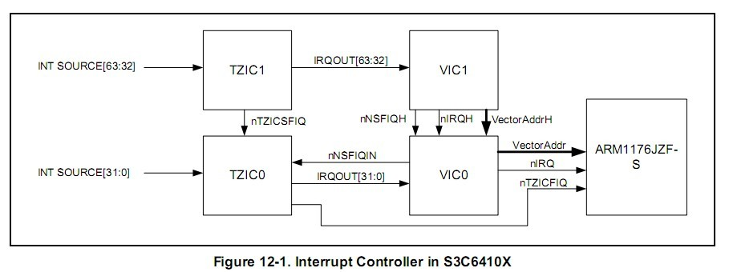
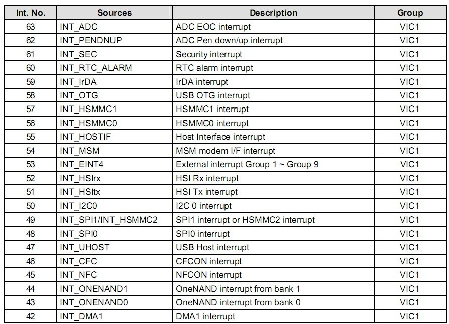
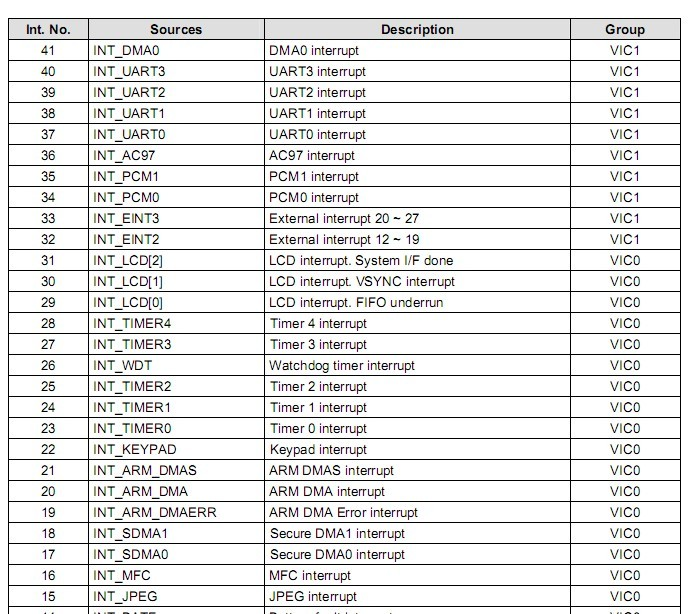
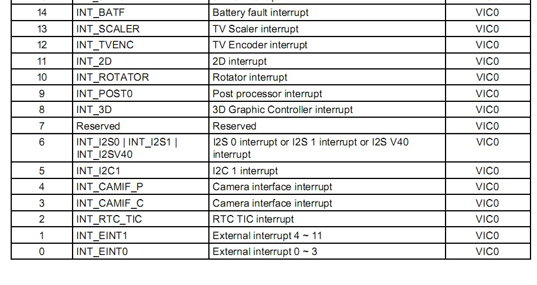

Tiny6410 interrupt
====

###ARM体系CPU的7种工作模式

1. 用户模式（usr）：正常的程序执行状态
2. 快速中断模式（fiq）：用于高速数据传输或通道处理
3. 中断模式（irq）：用于通用的中断处理
4. 管理模式（svc）：操作系统使用的保护模式
5. 系统模式（sys）：运行具有特权的操作系统任务
6. 数据访问终止模式（abt）：当数据或指令预取终止时进入该模式，可用于虚拟存储以及存储保护
7. 未定义指令终止模式（und）：当未定义的指令执行时进入该模式，可用于支持硬件

除了用户模式(usr)以外，其他6种工作模式都属于特权模式。特权模式中除了系统模式以外的其余5种模式称为异常模式。        
大部分程序运行在用户模式，进入特权模式是为了处理中断、异常、或者访问被保护的系统资源。     
    

Arm的工作模式切换有两种方法：

* 被动切换：在arm运行的时候产生一些异常或者中断来自动进行模式切换
* 主动切换：通过软件改变，即软件设置寄存器来经行arm的模式切换，应为arm的工作模式都是可以通过相应寄存器的赋值来切换的。

Tips：当处理器运行在用户模式下，某些被保护的系统资源是不能被访问的。

###ARM体系CPU的2种工作状态
* ARM状态：处理器执行32位的字对齐的ARM指令    
	ARM微处理器共有37个32位寄存器，其中31个为通用寄存器，6个位状态寄存器。但是这些寄存器不能被同时访问，具体哪些寄存器是可以访问的，取决ARM处理器的工作状态及具体的运行模式。但在任何时候，通用寄存器R14~R0、程序计数器PC（即R15）、一个状态寄存器都是可访问的。
* Thumb状态：处理器执行16位的、半字对齐的Thumb指令    
Thumb状态下的寄存器集是ARM状态下寄存器集的一个子集，程序可以直接访问8个通用寄存器（R7～R0）、程序计数器（PC）、堆栈指针（SP）、 连接寄存器（LR）和CPSR。同时，在每一种特权模式下都有一组SP、LR和SPSR。

在程序运行的过程中，可以在两种状态之间进行相应的转换。处理器工作状态的转变并不影响处理器的工作模式和相应寄存器中的内容。

###ARM寄存器

ARM有31个通用的32位寄存器，6个程序状态寄存器，共分为7组（进入某个工作模式，就使用对应某组的寄存器），有些寄存器是所有工作模式共用的，还有一些寄存器专属于每一种工作模式。任何工作模式下，都有通用寄存器R14~R0、程序计数器PC(即R15)、一个状态寄存器是可访问的。

|用户模式(User)|系统模式(System)|管理模式(Supervisor)|数据访问终止模式(Abort)|未定义指令终止模式(Undefined)|外部中断模式(IRQ)|	快速中断模式(FIQ)|
| ------ | ------ |------ |------ |------ |------ |------ |
|R0		|R0			|R0			|R0			|R0			|R0			|R0			|
|R1		|R1			|R1			|R1			|R1			|R1			|R1			|
|R2		|R2			|R2			|R2			|R2			|R2			|R2			|
|R3		|R3			|R3			|R3			|R3			|R3			|R3			|
|R4		|R4			|R4			|R4			|R4			|R4			|R4			|
|R5		|R5			|R5			|R5			|R5			|R5			|R5			|
|R6		|R6			|R6			|R6			|R6			|R6			|R6			|
|R7		|R7			|R7			|R7			|R7			|R7			|R7			|
|R8		|R8			|R8			|R8			|R8			|R8			|R8_fiq		|
|R9		|R9			|R9			|R9			|R9			|R9			|R9_fiq		|
|R10	|R10		|R10		|R10		|R10		|R10		|R10_fiq	|
|R11	|R11		|R11		|R11		|R11		|R11		|R11_fiq	|
|R12	|R12		|R12		|R12		|R12		|R12		|R12_fiq	|
|R13	|R13		|R13_svc	|R13_abt	|R13_und	|R13_irq	|R13_fiq	|
|R14	|R14		|R14_svc	|R14_abt	|R14_und	|R14_irq	|R14_fiq	|
|R15(PC)|R15(PC)	|R15(PC)	|R15(PC)	|R15(PC)	|R15(PC)	|R15(PC)	|
|CPSR	|CPSR		|CPSR		|CPSR		|CPSR		|CPSR		|CPSR		|
|		|			|SPSR_svc	|SPSR_abt	|SPSR_und	|SPSR_irq	|SPSR_fiq	|

####通用寄存器
* **未分组寄存器 R0 ~ R7**    
	在所有运行模式下,未分组寄存器都指向同一个物理寄存器,它们未被系统用作特殊的用途.因此在中断或异常处理进行运行模式转换时,由于不同的处理器运行模式均使用相同的物理寄存器,所以可能造成寄存器中数据的破坏.
* **分组寄存器 R8 ~ R14**    
	同一个寄存器名(例如R13)，在ARM微处理器内部存在多个独立的物理寄存器，每一个物理寄存器分别与不同的处理器模式对应(R13\_fiq, R13\_svc, ... )。这些寄存器被称为“备份寄存器"。       
	对于R8~R12来说,每个寄存器对应2个不同的物理寄存器,当使用FIQ(快速中断模式)时,访问寄存器R8\_fiq~R12\_fiq;当使用除FIQ模式以外的其他模式时,访问寄存器R8_usr~R12\_usr。       
	对于R13,R14来说,每个寄存器对应6个不同的物理寄存器,其中一个是用户模式与系统模式共用,另外5个物理寄存器对应其他5种不同的运行模式,并采用记号来区分不同的物理寄存器: R13\_fiq, R13\_svc, R13\_abt...      
	快速中断模式有7个备份寄存器(R8\_fiq ~ R14\_fiq), 这使得进入快速中断模式执行很大部分程序时，甚至不需要保存R8~R12的寄存器。其他模式，因为要和普通模式共用R8~R12寄存器，所以需要在执行程序前将寄存器入栈，执行完程序后再弹栈。
	* R13 - 堆栈指针寄存器 SP   
		寄存器R13在ARM指令中常用作**堆栈指针SP**,但这只是一种习惯用法，用户也可使用其他的寄存器作为堆栈指针,而在Thumb指令集中,某些指令强制性的要求使用R13作为堆栈指针.    由于处理器的每种运行模式均有自己独立的物理寄存器R13，在用户应用程序的初始化部分，一般都要初始化每种模式下的R13，使其指向该运行模式的栈空间。这样，当程序的运行进入异常模式时，可以将需要保护的寄存器放入R13所指向的堆栈，而当程序从异常模式返回时，则从对应的堆栈中恢复，采用这种方式可以保证异常发生后程序的正常执行。
	* R14 - 程序链接寄存器(Subroutine Link Register)    
		R14称为**程序链接寄存器LR(Link Register)**,当执行子程序调用指令(BL)时,R14可得到R15(程序计数器PC)的备份.在每一种运行模式下，都可用R14保存子程序的返回地址，当用BL或BLX指令调用子程序时，将PC的当前值复制给R14，执行完子程序后，又将R14的值复制回PC，即可完成子程序的调用返回。以上的描述可用指令完成。
* **程序计数器 PC(R15)**    
	寄存器R15用作**程序计数器(PC)**,在ARM状态下,位[1:0]为0,位[31:2]用于保存PC,在Thumb状态下,位[0]为0,位[31:1]用于保存PC.   
	**由于ARM体系结构采用了多级流水线技术，对于ARM指令集而言，PC总是指向当前指令的下两条指令的地址,即PC的值为(当前指令的地址值)加(8个字节);**
* **当前程序状态寄存器 R16**   
	寄存器R16用作**CPSR(CurrentProgram Status Register，当前程序状态寄存器)**，CPSR可在任何运行模式下被访问，它包括条件标志位、中断禁止位、当前处理器模式标志位，以及其他一些相关的控制和状态位。 
	
每一种运行模式下又都有一个专用的物理状态寄存器，称为**SPSR(Saved Program Status Register，备份的程序状态寄存器)**，当异常发生时，SPSR用于保存CPSR的当前值，从异常退出时则可由SPSR来恢复CPSR。由于用户模式和系统模式不属于异常模式，它们没有SPSR，当在这两种模式下访问SPSR，结果是未知的;
	1. 条件码标志（28-31位） N(Negative)、Z(Zero)、C(Carry)及V(Overflow)统称为条件码标志位。其内容可被算术和逻辑运算的结果所改变，由此可以决定某些指令是否被执行。
	
	2. Q标志位（第27位） 在ARM V5及以上版本的E系列处理器中，用Q标志位指示增强的DSP运算指令是否发生了溢出。在其他版本的处理器中，Q标志位无定义。
	3. CPSR的控制位（第7-0位） CPSR的低8位（包括I、F、T和M[4:0]）称为控制位，当发生异常时这些位可以被改变。如果处理器运行特权模式，这些位也可以由程序修改。
		* 中断禁止位I(IRQ)，F(FIQ)： I=1禁止IRQ中断 F=1禁止FIQ中断
		* T(Thumb)标志位：该位反映处理器的运行状态 对于ARM体系结构V4及以上的版本的T系列处理器，当该位为1时，程序运行与Thumb状态，否则运行于ARM状态。 对于ARM体系结构V5及以上的版本的非T系列处理器，当该位为1时，执行下一条指令以引起未定义的指令异常；当该位为0时，表示运行于ARM状态。
		* 运行模式位M[4:0]：M0、M1、M2、M3、M4是模式位。这些位决定了处理器的运行模式。    
 
			|M[4:0]|处理器模式|
			| ---- | ------ |
			| 0b10000 | 用户模式 |
			| 0b10001 | 快速中断(FIQ) |
			| 0b10010 | 外部中断(IRA) |
			| 0b10011 | 管理模式 |
			| 0b10111 | 中止模式 |
			| 0b11011 | 未定义模式 |
			| 0b11111 | 系统模式 |
		* 其他的位为保留位，用作以后的扩展。

----

###异常工作流程
产生一个异常后，CPU自动执行：

1. 在异常工作模式的连接寄存器R14中，保存前一个工作模式的下一条要执行的指令的地址（方便返回）。对于ARM状态下工作的CPU， 这个地址是当前PC值加4或加8；
2. 将CPSR的值复制到异常模式的SPSR（SPSR就是用来保存前一个工作模式的CPSR的）。
3. 将CPSR的工作模式设为这个异常对应的工作模式。
4. 令PC值等于这个异常模式在异常向量表中的地址，即跳转去执行异常向量表的相应指令。

执行完异常向量服务后，应该在程序的最后，软件实现下面工作，返回之前的工作模式。

1. 将连接寄存器R14的值减去合适的值（4或8）后，复制给PC。之前存的是R14=PC+4的话，现在就是R14-4=PC;
2. 将SPSR的值复制回CPSR。

| 异常模式 | 进入异常模式时R14保存的值(ARM状态) | 退出异常时PC的计算方法 |
| ----- | ----- | ----- |
| 管理模式(通过SWI指令进入该模式) | PC(SWI指令地址) + 4 | MOVS PC, R14 |
|未定义指令终止模式 | PC(未定义指令地址) + 4 | MOVS PC, R14 |
|快速中断模式| PC(进入快速中断模式前，被打断，未执行的指令地址) + 4| SUBS PC, R14, #4 |
|中断模式| PC(进入中断模式前，被打断，未执行的指令地址) + 4| SUBS PC, R14, #4|
|数据访问终止模式|PC(导致数据访问终止的指令地址)+4|SUBS PC, R14, #4|
|数据访问终止模式|PC(导致数据访问终止的指令地址)+8|SUBS PC, R14, #8|

* 管理模式，未定义指令终止模式，进入异常模式时，PC为SWI指令或未定义指令地址，将下一步要执行的执行地址(PC+4)存入R14, 退出异常模式时，将R14传给PC即可。
* 中断，数据访问终止模式，PC为被中断、被终止的指令地址，将其PC+4的值传给R14，退出异常模式时，要将R14的值减去4再传给PC，则重新执行之前被打断的指令。

----

##S3C6410 - VECTORED INTERRUPT CONTROLLERS
 
 参考资料: S3C6410X.pdf - Chapter 12 - VECTORED INTERRUPT CONTROLLERS   
 This chapter describes the functions and usage of Vectored Interrupt Controller in S3C6410X RISC microprocessor.
 
 
 与S3C2440的中断处理机制相比, S3C6410大大简化了中断编程处理：   
  
 * 增加中断向量控制器，这样在S3C2440里需要用软件来跳转的中断处理机制，在S3C6410完全由硬件来跳转。（即，在S3C2440下是由CPU触发IRQ/FIQ异常，由异常处理函数里再查找相关中断寄存器来跳到指定的ISR，而可以全部由S3C6410的VIC硬件来自动处理。 ）
 * 外部中断加入滤波电路，这样原来需要软件去毛刺的地方均可以采用硬件来进行滤波。
 * 为了向下兼容，6410保留了2410的软件中断跳转方式，在三星的文档里被称为SystemBUS模式，默认的，而其特有的VIC Port模式则要手动开启。

###VIC
The interrupt controller in the S3C6410X is composed of 2 VIC’s (Vectored Interrupt Controller, ARM PrimeCell PL192) and 2 TZIC’s (TrustZone Interrupt Controller, SP890).

特性：

* 每个VIC控制器包含32向量中断
* 固定的硬件中断优先级别
* 可编程的中断优先级
* 支持硬件的中断优先级屏蔽
* 可编程的硬件的中断优先级屏蔽
* 可产生一般中断和快速中断
* 可产生软件中断
* 原生的中断状态
* 中断请求状态
* 支持特权模式来限制访问

S3C6410共有64个中断源，64个中断按硬件分组分成VIC0, VIC1两个组，各组由一个相应寄存器来处理。   

* 中断号为0-31是VIC0组, INT SOURCE[31:0]
* 中断号为32-63是VIC1组, INT SOURCE[63:32]

一个中断控制器是用来处理多个中断源的外围设备，通常包含以下几个特性：

* 为每个中断源分配一个中断请求输入端口。为每个中断请求分配一个中断请求输出端口，以能连接到处理器的VIC端口。
	
		中断源-------->PL192 VIC--------->处理器VIC端口
* 可以用软件屏蔽掉任意制定的中断源的中断
* 可以为每个中断设置优先级

以上都是中断控制器做的事情，软件方面，需要编程：

* 确定请求服务的中断源（从而决定应该调用哪个中断服务函数）
* 编写中断处理函数
* 确定中断处理程序的地址（中断服务函数地址）

**VIC的快速中断处理**
PL192 VIC是不支持快速中断的，所以在s3c6410中断流程图中，所有的快速中断跑到VIC1, 然后经过nNSFIQH到VIC0, 然后经过nNSFIQIN到TZIC0, 然后经过nTZICFIQ发送到ARM1176;

**1. 打开中断VICxINTENABLE**    
Interrupt Enable Register     

1. 0-31中断使用VIC0INTENABLE(0x7120_0010)
2. 32-63中断使用VIC1INTENABLE(0x7130_0010)    

* 0 = interrupt disable (reset)    
* 1 = interrupt enable    

VICxINTENABLE用来使能中断，VICxINTENCLEAR用来关闭中断。
给VICxINTENABLE的某一位写0是无法关闭中断的。

**2. 关闭中断VICxINTENCLEAR**    

Interrupt Enable Clear Register   

1. VIC0INTENCLEAR(0x7120_0014)
2. VIC1INTENCLEAR(0x7130_0014)

* 0 = no effet 
* 1 = interrupt disabled in VICINTENABLE

**3. 设置中断类型**    
设置某一个中断是IRQ还是FIQ，注意只有一个中断才能FIQ。
设置对应位1表示设为FIQ模式。

1. VIC0INTSELECT(0x7120_000C)
2. VIC1INTSELECT(0x7130_000C)

* 0 = IRQ interrupt(reset)
* 1 = FIQ interrupt

**4. 设置中断服务函数地址(ISR)**    
S3C6410用两个32个地址连续的寄存器，组成两个寄存器数组，分别表示中断服务函数。可以像指针数组一样来操作它们，数组的下标就是中断号，例如第3号中断函数地址VIC0VECTADDR[3];   
    
Vector Address [31:0] Register       

1. VIC0VECTADDR[31:0], (0x7120_0100 ~ 0x7120\_017C)
2. VIC1VECTADDR[31,0], (0x7130_0100 ~ 0x7130\_017C)

**5. 设置中断优先级**    

Vector Priority [31:0] Register   

1. VIC0VECTPRIORI[31,0], (0x7120_0200 ~ 0x7120\_027C)
2. VIC1VECTPRIORI[31,0], (0x7130_0200 ~ 0x7130\_027C)

每个寄存器的取值范围位0~15, 只使用[3:0]这四位。默认值为0xF;

----

###外部中断

64个中断源中，除了INT_EINT0~INT_EINT4以外(通过CPU外的外设触发中断)，其他中断都是由S3C6410内部的模块所触发，称为内部中断。

####外部中断引脚
S3C6410共有127个外部中断，其外接I/O引脚及分组如下：

1. Group 0（共28脚）, GPN0~GPN15, GPL8~GPL14, GPM0~GPM4
2. Group 1, GPA0~GPA7, GPB0~GPB6
3. Group 2, GPC0~GPC7
4. Group 3, GPD0~GPD5
5. Group 4, GPF0~GPF14
6. Group 5, GPG0~GPG7
7. Group 6, GPH0~GPH9
8. Group 7, GPO0~GPO15
9. Group 8, GPP0~GPP14
10. Group 9, GPQ0~GPQ9

####外部中断源

外部中断引脚对应VIC的中断号：

| Int. No.| Sources | Description |
| :------:| :-----: | :---------: |
|53| INT_EINT4| External interrupt Group 1 ~ Group 9 |
|33| INT_EINT3| External interrupt Group 0: 20 ~ 27|
|32| INT_EINT2| External interrupt Group 0: 12 ~ 19|
|1|INT_EINT1|External interrupt Group 0: 4 ~ 11|
|0|INT_EINT0|External interrupt Group 0: 0 ~ 3|

外部中断一共占用VIC的5个中断号，且其中四个是外部中断组0(External interrupt Group 0), 外部中断组1~9只占用一个VIC中断号(No.53, External interrupt Group 1 ~ Group 9);

为了节约中断，不可能为每个外部管脚都分配一个中断号，所以就会把某几个外部中断给合并成一个中断号。例如，对于外部中断0-3，就合并成了一个中断号，INT\_EINT0。当这4个中断有任意一个产生中断时，INT_EINT0会挂起，CPU就会知道产生了外部中断0-3中断，然后去执行中断处理，在中断服务程序中，为了知道具体是哪一个中断，还需要去查询寄存器以知道是哪一个中断产生。    

中断脚的判断：   
不同的IO脚上多个设备产生同一个中断，软件如何知道是哪一个脚？   
由External Interrupt Pending Register 来判断     

* 第0组由EINT0PEND来判断
* 第1，2组由EINT12PEND来判断
* 依此类推，EINT34PEND，EINT56PEND， 一直到EINT9PEND 来指示

###S3C6410中断处理方式

S3C6410中断处理有向量模式和非向量方式。    
因为要与之前的ARM系列兼容，所以保存了非向量方式。   

1. System BUS调用    
	向下兼容（与S3C2440中断机制相同）, 非向量方式，就是当中断产生时，都跳转到中断异常去，然后这个中断异常中，编写程序，判断是哪一个中断产生，然后去执行对应的中断处理程序。
	
		中断信号产生(中断源) 
		-> 中断信号过滤(中断控制器) 
		-> 中断信号处理(CPU) 
		-> CPU接受到中断信号，直接跳转到用户设置好的中断处理程序中 
		-> 保存环境 
		—> 判断具体中断源，调用对应中断服务程序 
		-> 恢复环境，PC指向中断时的指令继续执行
	
2. VIC Port模式调用    
	在非向量模式中，提前设定每个中断对应的入口地址，这样当中断产生的时候，就不用跳转到中断异常去了，直接跳转到对应的中断程序去了。这样中断处理的效率就提高了。    
	系统产生中断后，由VIC直接执行相应的中断服务函数。（效率高，编程简单，需要在程序初始时加一段代码）    
	
		中断信号产生(中断源) 
		-> 中断信号过滤(中断控制器) 
		-> 中断信号处理(CPU) 
		-> 中断程序总入口
		-> 保存环境
		-> 判断具体中断源，调用对应中断服务程序
		-> 恢复环境

----

**外部中断编程**

 外部中断除了中断编程所有流程外，一般额外配置相应的GPxCON配置成中断脚。还要配置滤波方式和中断信号方式，还要打开外部中断掩码。

1. 中断源设置   
	1. 配置GPIO     
		配置相应的I/O口的寄存器GPxCON, 为中断模式。
	2. EINTxCONx，外部中断信号类型，设置何种信号才会被捕获。      
	主要是五种，低电平，高电平，上升沿，下降沿或者两者均可：    
	
		* 第0组用 EINT0CON0/EINT0CON1两个寄存器来设定.
		* 第1，2组采用 EINT12CON,
		* 第3,4组采用EINT34CON,    
		* 依此类推    
	
	3. EINTxMASK，外部中断组x的屏蔽寄存器          
	屏蔽某个外部中断，0＝发生中断,1＝不发生中断,默认是全屏蔽的。   
	当要使用某个中断的时候，就需要让这个中断使能，就需要在这个寄存器中的对应位写入0，来打开中断。    
		* EINT0MASK是第0组的使用   
		* EINT12MASK是第1,2组的中断掩码
	
	4. EINTxPEND，外部中断组x的中断挂起寄存器。   
		这个寄存器就是用来保存中断的状态的。当对应的中断产生时，对应的位为1。当中断处理完毕后，需要往对应对写入1进行清除。
	5. 过滤控制寄存器EINTxFLTCONx，设置滤波方式，延迟滤波或数字滤波。       
	对于一些波形不规整的外部中断信号，可以通过滤波电路让其变成规整，这样会简化软件的编写。     
  S3C6410有两种滤波电路，一种延时滤波（如按钮类中断可以采用这一类型），一种是数字采样滤波，其中数字采样滤波电路还要设采样宽度。

		* 第0组的滤波用EINT0FLTCON0，EINT0FLTCON1，EINT0FLTCON2，EINT0FLTCON3配置。
		* 第1,2组的滤波采用 EINT12FLTCON
		* 第3,4组的滤波采用 EINT34FLTCON
		* 第9组滤波 采用EINT9FLTCON    

		FLTEN表示是否打开滤波功能,FLTSEL是设置滤波方式，EINTn表示数字滤波采校的宽度。

2. 中断控制器VIC配置
	
	1. 在协处理器中开启VIC，在协处理器里设置VE位。
			
			mrc p15, 0, r0, c1, c0, 0
			orr r0, r0, #(1 << 24)
			mcr p15, 0, r0, c1, c0, 0
		将协处理器P15的寄存器C1中的bit24置1，该比特位为VIC使能位。    
	2. 关中断，清矢量地址寄存器并配置中断类型     
		
		* VICxINTENCLEAR, 写1 DISABLE
		* VICxINTSELECT,0=IRQ,1=FIQ
		* VICxADDRESS,矢量地址寄存器清零

	3. 配置中断函数入口地址 VICxVECTADDR[x]    
	4. VIC使能中断     
		VICxINTENABLE, 1=ENABLE, 写0无效    
		DISABLE只能通过VICxINTENCLEAR写1更改
	5. 总中断使能, CPSR Bit 8位I , 置1 ENABLE

3. 编写中断处理函数
	1. 保存环境（中断函数前和后要使用嵌入汇编，保存环境和恢复环境。）
	2. 中断服务处理
	3. 中断挂起位清零
	4. 中断执行地址清楚（VICxADDRESS寄存器在中断执行时，其值为中断函数的入口地址。中断执行完以后，要清零）
	5. 恢复环境
		

