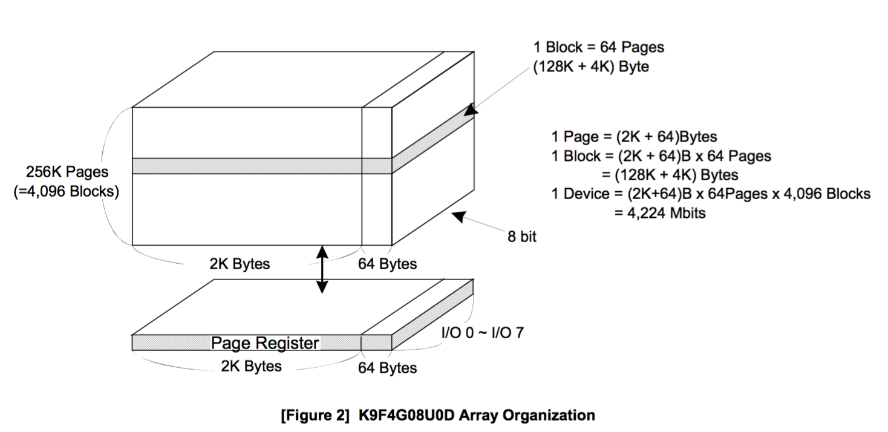
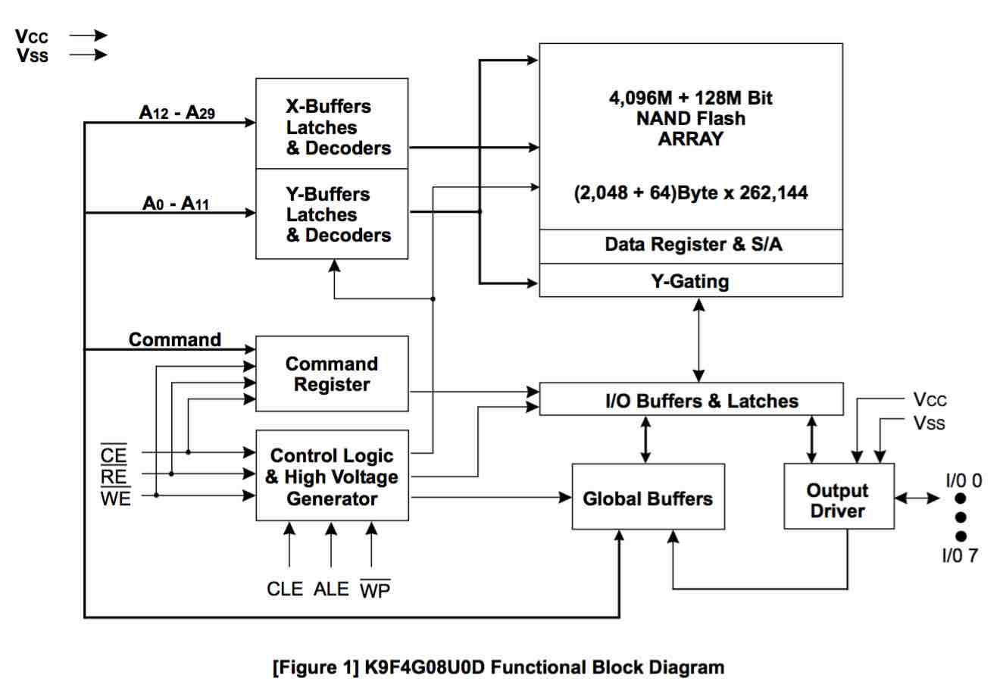

Tiny6410 - NAND Flash Controller
====

###Stepping Stone

The S3C6410X is equipped with an internal SRAM buffer called ‘Steppingstone’.    
Generally, the boot code will copy NAND flash content to SDRAM. Using hardware ECC, the NAND flash data validity will be checked. After the NAND flash content is copied to SDRAM, main program will be executed on SDRAM.    
To use NAND Flash, 'XSELNAND' pin must be connected to High Level. (原理图Tiny6410-1308.pdf中，'XSELNAND'引脚连接VDD3V3)

### Nand Flash Features


1. NAND Flash memory I/F: Support 512Bytes and 2KB Page .
2. Software mode: User can directly access NAND flash memory. for example this feature can be used in read/erase/program NAND flash memory.
3. Interface: 8-bit NAND flash memory interface bus.
4. Hardware ECC generation, detection and indication (Software correction).
5. Support both SLC and MLC NAND flash memory : 1-bit ECC, 4-bit and 8-bit ECC for NAND flash.
(Recommend: 1bit ECC for SLC, 4bit and 8bit ECC for MLC NAND Flash)
6. SFR I/F: Support Byte/half word/word access to Data and ECC Data register, and Word access to other registers
7. SteppingStone I/F: Support Byte/half word/word access.
8. The Steppingstone 8-KB internal SRAM buffer can be used for another purpose . (S3C6410 Stepping Stone: 0x0C000000 ~ 0x0C001FFF (8K) )

### NAND Flash Chip
SAMSUNG K9K8G08U0E-SCB0, 8G bit Nand Flash,1Gx8 SLC(1G字节)        
K9F4G08U0E , K9K8G08U0E, 同一个芯片手册;

型号说明：
<http://www.elnec.com/device/Samsung/K9F4G08U0E+%5BTSOP48%5D/>

	- K = Memory
	- 9 = NAND Flash
	- F = SLC Normal ; K = SLC Die Normal, SLC Die stack;
	- Density: 4G = 4Gbit, 8G = 8Gbit;
	- Technology: 0 = Normal (x8)
	- Organization: 8 = x8
	- Supply Voltage: U = 2.7V to 3.6V
    - Mode: 0 = Normal
	- Generation: E = 6th generation
	

K9K8G08U0E:     

* 1 Page = (2K + 64) Bytes
* 1 Block = (2k + 64)B x 64 Pages = (128K + 4K) Bytes
* 1 Device = (2K + 64)B x 64 Pages x 8,192 Blocks = 8,448 Mbits = (8192 + 256)Mbits    
* 其中可用空间为8192Mbits(1GB), 另外256Mbits(32M)存放ECC校验码;

NAND芯片只有8条I/O线，命令、地址、数据都要通过这8个I/O口输入输出。这种形式减少了NAND芯片的引脚个数，并使得系统很容易升级到更大的容量（强大的兼容性）。

* 写入命令、地址或数据时，都要将WE#,CE#信号同时拉低
* 数据在WE#信号的上升沿被NAND Flash锁存
* 命令锁存信号CLE，地址锁存信号ALE用来分辨、锁存命令/地址。
* K9K8G08U0E的1GB存储空间，需要30位地址(2^30 = 1GB, address[29:0])，因此以字节为单位访问Nand Flash时需要5个地址序列：
	* 1st Cycle, (A0~A7)
	* 2st Cycle, (A8~A11)
	* 3st Cycle, (A12~A19)
	* 4st Cycle, (A20~A27)
	* 5st Cycle, (A28~A29)
* 列地址(A0~A10), 11根地址线, 从0x000 ~ 0x7ff(0b0111\_1111\_1111), 共2^11=2048个字节;
* 行地址(A11~A29), 19根地址线, 2^19=512K个页面;
	* 页地址(Page Address): A11 ~ A16, 2^6=64页;
	* 块地址(Block Address): A17 ~ A29, 2^13=8192块;

* **SLC**    
	传统上，每个存储单元内存储1个信息比特，称为单阶存储单元（Single-Level Cell,SLC），使用这种存储单元的闪存也称为单阶存储单元闪存（SLC flash memory），或简称SLC闪存。SLC闪存的优点是传输速度更快，功率消耗更低和存储单元的寿命更长。然而，由于每个存储单元包含的信息较少，其每百万字节需花费较高的成本来生产。
* **MLC**     
	多阶存储单元（Multi-Level Cell,MLC）可以在每个存储单元内存储2个以上的信息比特，其“多阶”指的是电荷充电有多个能阶（即多个电压值），如此便能存储多个比特的值于每个存储单元中。借由每个存储单元可存储更多的比特，MLC闪存可降低生产成本，但比起SLC闪存，其传输速度较慢，功率消耗较高和存储单元的寿命较低，因此MLC闪存技术会用在标准型的储存卡。
* **TLC**     
	三阶储存单元（Triple-Level Cell, TLC），这种架构的原理与MLC类似，但可以在每个储存单元内储存3个信息比特。TLC的写入速度比SLC和MLC慢，寿命也比SLC和MLC短，大约1000次。现在，厂商已不使用TLC这个名字，而是称其为3-bit MLC。
	
###硬件连接

| S3C6410 | I/O | K9K8G08U0E |
| :-----: | :-: | :--------: |
| Xm0DATA0 ~ Xm0DATA7| R/W | IO0 ~ IO7(I/O引脚)|
| Xm0RPn/RnB/GPP7| R | R/nB(就绪/忙碌状态信号)|
| Xm0RDY0/ALE/GPP3 | W | ALE(地址锁存信号) |
| Xm0RDY1/CLE/GPP4 | W | CLE(命令锁存信号) |
| Xm0CSn2/GPO0 | W | nCE(芯片使能, 低电平有效) |
| Xm0INTsm1/FREn/GPP6 | W | nRE(读使能, 低电平有效) |
| Xm0INTsm0/FWEn/GPP5 | W | nWE(写使能, 低电平有效) |
| VDD3V3 | W | nWP(写保护, 低电平有效) |

备注: 通常在信号前加'n'表示低电平有效:  

* R/nB, 高电平为Ready, 低电平为Busy;
* nCE, 低电平有效，使能芯片;
* nWE, nRE, 低电平有效，写/读使能;
* ALE, CLE, 高电平有效, 地址/命令锁存信号;
	
### Command Sets
| Function | 1st Cycle | 2nd Cycle | Acceptable Command during Busy | 
| :------: | :-------: | :-------: | :----------------------------: |
| Read | 00h | 30h | |
| Read for Copy Back | 00h| 35h||
|Read ID|90h|-||
|Reset|FFh|-|O|
|Page Program|80h|10h||
|Two-Plane Page Program|80h---11h|81h---10h||
|Copy-Back Program|85h|10h||
|Two-Plane Copy-Back Program|85h---11h|81h---10h||
|Block Erase|60h|D0h||
|Two-Plane Block Erase|60h---60h|D0h||
|Random Data Input|85h|-||
|Random Data Output|05h|E0h||
|Read Status|70h||O|
|Read Status 2|F1h||O|

1. Read     
	发送命令00h, 发送5个Cycle的地址(1st/2st Cycle为列地址, 3,4,5为行地址)，发送命令30h, 之后Nand Flash的R/nB信号线变为低电平(Busy), 为读取数据。读取出数据后，变为高电平(Ready).之后通过不断拉低nRE(读信号使能)，从I/O口读出数据; 从I/O口读数据期间，如果拉高nCE使能信号引脚，则I/O引脚不再发送数据;
	
2. Random Data Output
	* 00h
	* Column Address + Row Address
	* 30h
	* Waitting for R/nB
	* I/O口开始发送数据
	* 05h
	* Column Address
	* E0h
	* I/O口从特定列地址位置发送数据
	
3. Page Program
	* 80h
	* Column Address + Row Address
	* 1 up to m Byte Data (Serial input from I/O0~7)
	* 10h
	* waitting for R/nB Ready.
	* 70h
	* Read I/O 0 (IO0 = 0, Successful Program; IO0 = 1, Error in Program)

	先通过80h-地址-数据-10h写数据（最多一页528Bytes), 然后通过70h读状态;状态位通过I/O 0表示。
	
4. Copy-Back Program    
	Copy-Back功能，将一页数据拷贝到另一页中（不需要从Nand Flash中拷贝出来到SDRAM，再写到另一页；而是直接读取数据到内部的页寄存器Page Register, 然后写到新的页中。)     
	* 00h
	* Column Address + Row Address
	* 35h ( 00h-35h, Read for Copy Back)
	* 数据写入内部的Page Register
	* 85h
	* Column Address + Row Address
	* 从Page Register中读出数据
	* 10h
	* Waitting for R/nB to Ready
	* 70h
	* Read IO0 Status.
