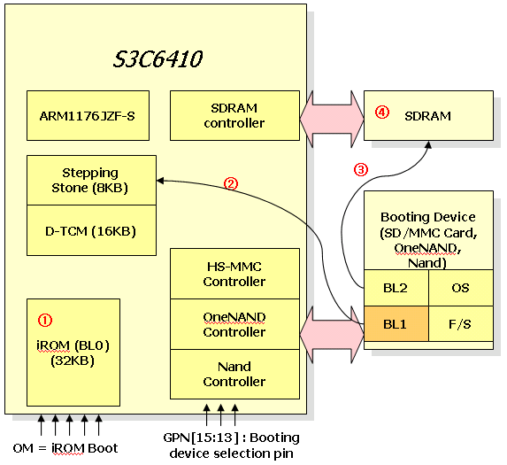
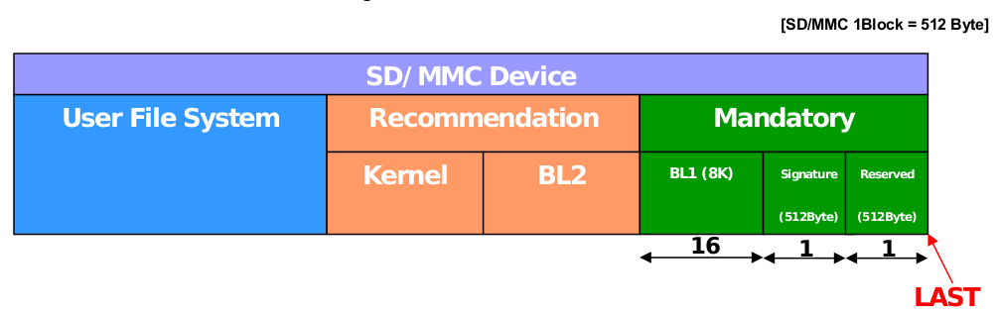
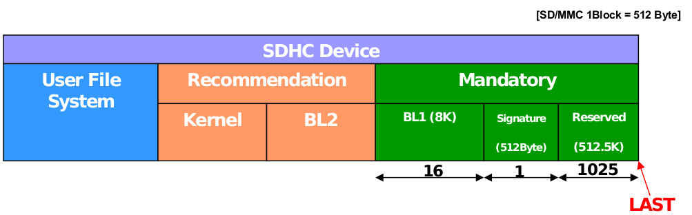

SD Boot - SD卡启动
==================

###目标主板: FriendlyARM Tiny6410   
###目标：**SD卡启动裸机程序**    

参考:     
* [S3C6410制作SD启动卡](http://www.amobbs.com/forum.php?mod=viewthread&tid=3472292)     
* [关于s3c6410的SD卡启动](http://blog.csdn.net/jenkinslee/article/details/7219051)  
* [6410SD卡启动原理](http://www.cnblogs.com/lp1129/articles/3371177.html)

1. s3c6410启动过程分成BL0, BL1, BL2几个阶段。其中BL0是固化在s3c6410内部的IROM中的, 该段程序根据所选择的启动模式从存储介质加载BL1.
2. s3c6410支持从多种存储介质中启动，nandflash, sd卡，sdhc卡，OneNand, MoviNand.... 其中，BL1和BL2存储于这些存储介质中，BL1的8K数据由BL0的程序自动加载到s3c6410的stepping stone中运行；

4. BL1,BL2的存储位置固定。对于sd卡, BL1位于 (totalSector - 18) 的扇区；对于sdhc卡，BL1位于(totalSector-1042)的扇区。BL1由BL0加载到 0x0C000000处运行，大小为8K.

SD & SDHZ区别

1. 容量    
	
	* SD卡容量小，最高为2GB;
	* SDHC容量大，2GB, 4GB, 32GB等等;
2. 存储卡正面的标识贴纸（厂商、容量、类型）    
	看标识是最保险的方法...

###备注: 
6410的手册上说，可以从nandflash、onenand、SD卡启动，没有专用的烧录工具的情况下，只有SD卡启动是可以考虑的。手册上看到，SD卡启动，实际上是先执行片内IROM中的一段程序，该程序从SD卡中读取代码，写到stepping stone中，stepping stone是位于0x0c000000、size为8K的片内内存，代码写入stepping stone后，跳到0x0c000000处继续执行程序。

①  iROM supports initial boot up,initialize system clock,D-TCM,device specific controller and bootin device.     
②  iROM boot codes can load 4KB of bootloader to stepping stone. The 8KB boot loader is called BL1.    
③  BL1: BL1 can initialize system clock, UART, and SDRAM for user. After initializing, BL1 will load remaining boot loader which is called BL2 on the SDRAM .    
④  Finally, jump to start address of BL2. That will make good environment to use system.     

关于SDHC的最后1025个扇区(Reserved):     
s3c6410有一个缺点，就是在识别SDHC卡的时候会忽略后面的1024的块，也就是512K的空间，所以在往SDHC卡内部存储
程序时只能抛弃后面的512K的空间。    
**对于S3C6410，根本就不知道最后1024个扇区的存在。S3C6410总是在-18扇区位置（对于SDHC，实际为-(18
+1024)扇区）读取BL1数据。**   

---- 
###SD卡启动裸机程序    
要实现SD卡启动裸机程序，只需要将裸机程序编译好，写入到SD卡的BL1区域即可。上电后，S3C6410的iROM会执行BL0程序，加载BL1中的数据到Stepping Stone，然后跳转到Stepping Stone中执行。
    
0. 格式化SD卡(FAT32格式)
1. 编写一个最简单的点灯程序(LED1~LED4全亮)，这里使用ARM-Tiny6410/led/1.leds_s/。
2. Makefile 中设置： -Ttext 0x0c000000 （BL1由BL0加载到 0x0C000000处运行，大小为8K）
3. 交叉编译得到led.bin;
4. 将led.bin写入SD卡的BL1区域。
5. 将SD卡插入Tiny6410开发板，选择SD-BOOT启动模式，上电后，观测LED灯闪烁效果（一定时间闪烁一次）

linux系统中的dd命令，可以实现绝对扇区位置的数据写入。      

1. 使用fdisk命令，查看sd卡的大小：    

		$ sudo fdisk -l /dev/sdb  
		Disk /dev/sdb: 2059 MB, 2059403264 bytes  
	
2. 计算写入地址：SD卡的BL1在-(16+1+1)扇区，即2059403264 - 18 * 512 = 2059394048 bytes.
3. 写入：

		$ sudo dd if=./led.bin of=/dev/sdb seek=2059394048 bs=1
4. （附加：对于SDHC卡）SDHC卡的BL1在-(16+1+1024)扇区。

		➜  ~  sudo fdisk -l /dev/sdb
		Disk /dev/sdb: 7.4 GiB, 7948206080 bytes, 15523840 sectors
		7948206080 bytes - (16+1+1025) * 512 bytes = 7947672576
		$ sudo dd if=./led.bin of=/dev/sdb seek=7947672576 bs=1

----

