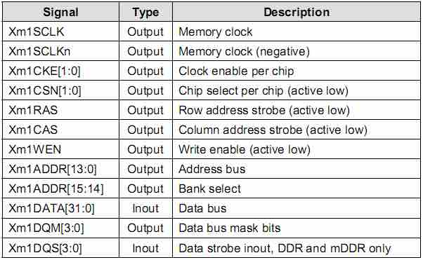

ARM-Tiny6410-DRAM
====
**备注：此文件内的程序所编译的sdram.bin, 不能通过MiniTools.exe的裸机程序选项下载。**    
因为此程序是学习DRAM控制器的配置，而使用MiniTools.exe的裸机程序下载，是已经配置好DRAM后，将代码下载到SDRAM中的0x50000000地址处运行。程序可以运行，但无法验证程序是否成功配置SDRAM。   
**解决方法1**:  使用MiniTools.exe的Linux选项，将sdram.bin数据文件下载到Nand FLash设备的Linux Bootloader的位置。（详情见sd-no-os/文件夹的ARM启动流程）    
**解决方法2**:  使用dd命令将.bin文件通过dd命令直接烧写到SDHC卡的BL1区域。（详情见sd-no-os/文件夹的ARM启动流程）   

----

<http://www.samsung.com/us/business/oem-solutions/pdfs/PSG_2H_2012.pdf>    
DRAM:       
SAMSUNG K4X2G323PD-8GD8   
Mobile DDR     
64Mx32    
200Mhz     
Halogen Free FBGA90    
90-FBGA, 800MHz      
1.8V

	K4X2G323PD-8GD8 
	K:		SAMSUNG Memort
	4:	 	DRAM
	X:		Mobile DDR SDRAM
	2G:		2G, 8K/64ms
	32:		x32 (bit organization)
	3:		4 of Internal Banks
	P:		LVTTL, 1.8V, 1.8V
	D:		5th Generation
	
	S/D: 90balls FBGA
	
**DDR SDRAM**:    
Double Rate Synchronous Dynamic Random Access Memory    
双倍速率传输，在时钟的上升沿和下降沿均可传输数据。

**2G, x32**
表示此SDRAM的容量为2G bit (64M x 32bit), 即256MB:

* 地址总数（存储单元总数） 64M
* 位宽（存储单元容量）32 bit

由芯片手册<K4X2G323PD-8GD8_90F_8x13_R10.pdf>可知:  

* Bank Address(BA0,BA1)，即4个Bank
* Row Address (A0 ~ A13)，即有2^14行;
* Column Address (A0 ~ A9)，即2^10列;

		地址总数（存储单元总数） = 4 Bank x 2^14行 x 2^10列 = 67108864单元 = 64 x 1024 x 1024 = 64M

DDR SDRAM的行地址和列地址共用同一地址总线，这个地址总线何时被用来做行地址或列地址，在DDR SDRAM数据手册中有详细的时序定义。

**8k/64ms**   
64ms，表示此SDRAM芯片的刷新时间(Refresh interval time)为64ms。   
目前公认的标准是，存储单元中电容的数据有效保存上限是64ms(1000ms = 1 s)。   
也就是说SDRAM存储单元中每一行新的循环周期都是64ms。   
8k/64ms，每8k行的扫描周期为64ms。相当于每一行扫描时间是64ms / 8k行 = 7.8125us(1000us = 1ms)。

----

硬件连接：


	nCS: 		Xm1CSn0
	nRAS:		Xm1RASn
	nCAS:		Xm1CASn
	nWE:		Xm1WEn
	
----

###DRAM控制器（DRAM CONTROLLER）
参考：<http://www.linuxidc.com/Linux/2011-09/42025.htm>   

6410使用DRAM控制器对DDR进行操作。   
在程序开始时要根据DDR的参数设置DRAM控制器。

S3C6410的DRAM控制器是采用的PL340内存控制芯片(ARM PrimeCell CP003 AXI Dynamic Memory Controller)。   

AMBA APB3.0接口协议规定，可以通过编程将AXI从总线接口和APB主总线接口进行桥接，实现二者总线上的数据的传输。

DRAM控制器可以通过配置**兼容SDRAM类型芯片**。通过向DRAM控制器中PL340写入内存芯片配置参数，内存时序，来控制内存工作。 

DRAM控制器可以直接从SDRAM或DRAM接收一个控制命令：

* 通过将操作命令写入direct_cmd寄存器，操作SDRAM进行对应操作。

* 通过向memc_cmd寄存器写入状态模式命令，使DRAM控制器进入对应的工作模式。

例如：向direct_cmd寄存器写入：'Prechargeall’，‘Autorefresh’，‘NOP’，and ‘MRS’ 等命令，可以让SDRAM芯片分别执行不同操作，向memc_cmd寄存器写入一些状态命令可以让SDRAM芯片进入’Config’, ‘Ready’, and ‘Low_power’等工作模式。 

DRAM控制器支持两种节能模式。当SDRAM处于不活动状态并且持续一定的时钟周期时，DRAM控制器会自动将SDRAM进入预充电节能模式或正常节能模式下以降低系统功耗。当驱动操作DRAM控制器进入对应的STOP（停止），Deep Stop（深度睡眠），Sleep Mode（睡眠）等模式时，SDRAM芯片进入自刷新的节能模式。

* 支持SDR SDRAM，Mobile SDR SDRAM，DDR SDRAM和Mobile DDR SDRAM类型芯片

* 支持两个内存芯片

* 支持64位的AMBA AXI总线类型

* 支持16位、64位内存总线
		
	* 存储器接口1：支持16位DDR SDRAM和Mobile DDR SDRAM类型芯片；
	*	支持32位DDR SDRAM，Mobile DDR SDRAM，Mobile SDR SDRAM和SDR SDRAM类型芯片；
	*	不支持16位Mobile SDR SDRAM和SDR SDRAM类型芯片

* 地址空间：存储器接口1支持最多2Gb地址空间
* 支持正常节能模式和预充电的节能模式
* 数据传输低延迟特性
* 外部存储器总线优化
* 通过设置SFR寄存器支持选择外部存储器选型
* 通过SFR寄存器配置存储器的时序
* 支持扩展MRS指令集
* 工作电压：存储器接口1:   1.8V，2.5V

----


####SDRAM类型内存接口


DRAM控制器支持最多两个相同类型的内存芯片，每个芯片最大容量256M。所有芯片共享相同引脚（时钟使能引脚和片选引脚除外），如表所示给出了DRAM控制器的外部存储器引脚配置信息。


####  SDRAM INITIALIZATION SEQUENCE - DDR/MOBILE DDR SDRAM
在系统上电后，必须通过软件配置SDRAM接入DRAM控制器并且初始化DRAM控制器，下面给出DDR、MOBILE DDR SDRAM的初始化流程。

1. Program memc_cmd to ‘3’b100’, which makes DRAM Controller enter ‘Config’ state.
2. Write memory timing parameter, chip configuration, and id configuration registers.    根据SDRAM芯片手册的数据进行配置。    
	**memory timing parameter** :
	
	* 刷新周期, P1REFRESH
	* P1CASLAT
	* P1T_DQSS
	* P1T_MRD
	* P1T_RAS
	* P1T_RC
	* P1T_RCD
	* P1T_RFC
	* P1T_RP
	* P1T_RRD
	* P1T_WR
	* P1T_WTR
	* P1T_XP
	* P1T_XSR
	* P1T_ESR
	
	**chip configuration** :
	
	* P1MEMCFG
	* P1MEMCFG2
	
	**id configuration** :
	
	* P1_chip_0_cfg
	
3. Wait 200us to allow SDRAM power and clock to stabilize. However, when CPU starts working, power and clock would already be stabilized.
4. Execute memory initialization sequence.

	1. Program mem_cmd in direct_cmd to ‘2’b10’, which makes DRAM Controller issue ‘NOP’ memory command.向mem_cmd寄存器写入2b10，使其进入NOP工作状态。

	2. Program mem_cmd in direct_cmd to ‘2’b00’, which makes DRAM Controller issue ‘Prechargeall’ memory command.向mem_cmd寄存器写入2b00，使其进入Prechargeall（整片预充电）工作状态。

	3. Program mem_cmd in direct_cmd to ‘2’b11’, which makes DRAM Controller issue ‘Autorefresh’ memory command.向mem_cmd寄存器写入2b11，使其进入Autorefresh（自刷新）工作状态。

	4. Program mem_cmd in direct_cmd to ‘2’b11’, which makes DRAM Controller issue ‘Autorefresh’ memory command.再次向mem_cmd寄存器写入2b11，使其进入Autorefresh（自刷新）工作状态。

	5. Program mem_cmd to ‘2’b10’ in direct_cmd, which makes DRAM Controller issue ‘MRS’ memory command − Bank address for EMRS must be set.向mem_cmd寄存器写入2b10，使其进入MRS工作状态，并且地址空间内的EMRS必须置位。

	6. Program mem_cmd to ‘2’b10’ in direct_cmd, which makes DRAM Controller issue ‘MRS’ memory command. − Bank address for MRS must be set.再次向mem_cmd寄存器写入2b10，使其进入MRS工作状态，并且地址空间内的MRS必须置位。

5. Program memc_cmd to ‘3’b000’, which makes DRAM Controller enter ‘Ready’ state.

6. Check memory status field in memc_stat until memory status becomes ‘2’b01’, which means ‘Ready’.

----

ISSUE
====

Makefile中，如果去掉main.c/uart.c/sdram.c编译选项中的**优化选项'-O2'**，编译出来的程序在ARM开发板上运行错误，无法实现正常的串口通信。

Makefile:

	test1:
		arm-linux-gcc -o start.o start.S -c
		arm-linux-gcc -o clock.o clock.c -c
		arm-linux-gcc -g -c -O2 -o main.o main.c    # must -O2 !!!
		arm-linux-gcc -g -c -O2 -o uart.o uart.c    # must -O2 !!!
		arm-linux-gcc -g -c -O2 -o sdram.o sdram.c  # must -O2 !!!
		arm-linux-ld -T sdram.lds -o sdram.elf start.o main.o clock.o uart.o sdram.o
		arm-linux-objcopy -O binary sdram.elf sdram.bin
		arm-linux-objdump -D sdram.elf > sdram.dis
	test2:
		arm-linux-gcc -o start.o start.S -c
		arm-linux-gcc -o clock.o clock.c -c
		#arm-linux-gcc -o main.o main.c -c          # 没有-O2优化选项，导致程序无法正常工作!
		arm-linux-gcc -g -c -o main.o main.c        # 删掉-O2优选选项，发现串口无法输入
		#arm-linux-gcc -o uart.o uart.c -c
		arm-linux-gcc -g -c -O2 -o uart.o uart.c
		#arm-linux-gcc -o sdram.o sdram.c -c
		arm-linux-gcc -g -c -O2 -o sdram.o sdram.c
		arm-linux-ld -T sdram.lds -o sdram.elf start.o main.o clock.o uart.o sdram.o
		arm-linux-objcopy -O binary sdram.elf sdram.bin
		arm-linux-objdump -D sdram.elf > sdram.dis

###[gcc常用选项对代码的影响](http://if.ustc.edu.cn/%7Exbzhou/blog/archives/sth_gcc.html#I198)

