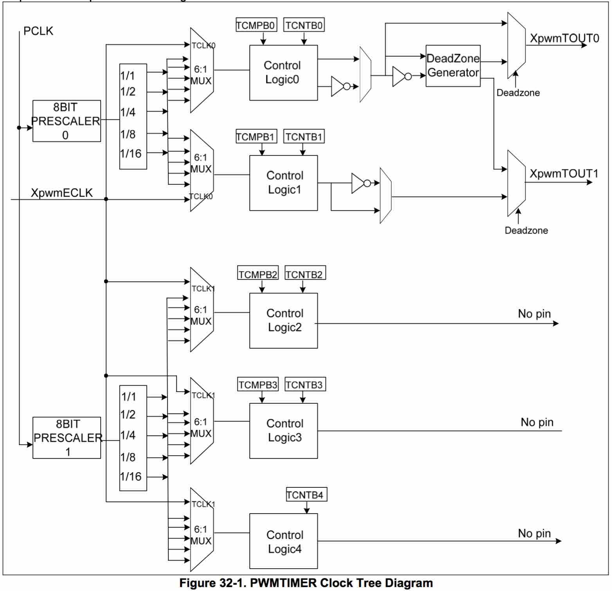
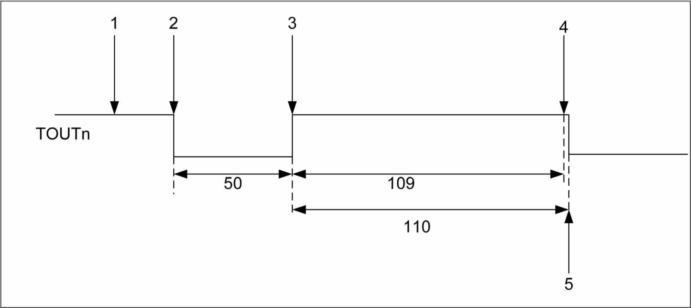
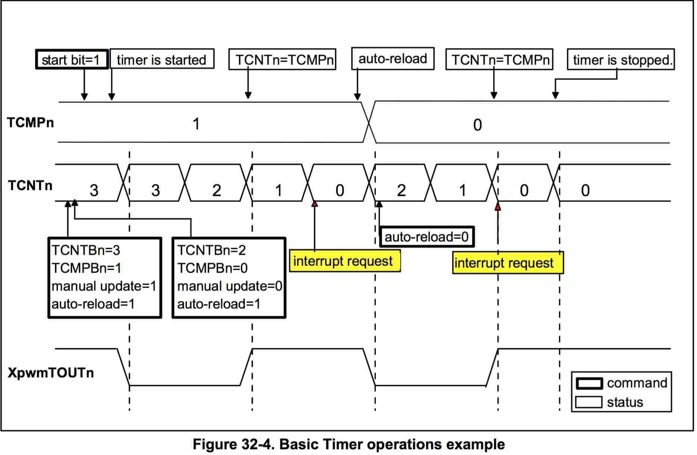
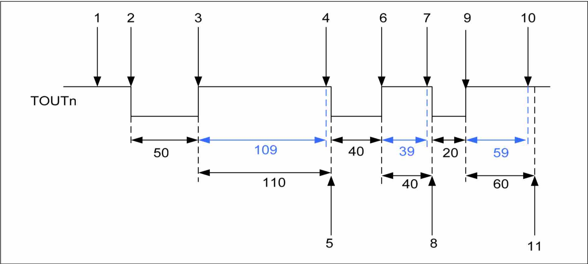
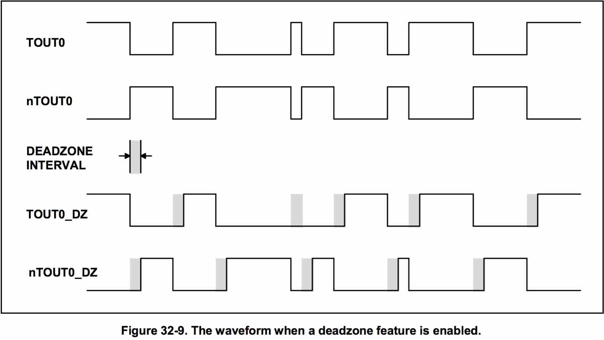

S3C6410 - Timer
====

S3C6410X RISC微处理器有5个32位的定时器。    
这些定时器在ARM子系统中主要是用来产生内部中断(internal interrupts):

* 定时器0和定时器1包含了PWM(Pulse Width Modulation) 功能，可以用来驱动一个外部I/O信号(XpwmTOUT0/XpwmTOUT1)。定时器0和定时器1具有可选的死区发生器的功能，可以用来支持更多的设备。
* 定时器2，3，4是内部定时器，没有输出引脚。

PWM支持如下特性:

* 五个32位的定时器；
* 多级分频，第一级为8位的时钟预分频器(8 bit Prescaler)，在第二级为5固定分频器和多路选择器。
* 对每个PWM都有独立的可编程时钟选择逻辑(Programmable Clock Select Logic)；
* 两个独立可编程占空比控制和极性的PWM通道(Programmable Duty Control and Polarity)；
* 支持自动加载模式(Auto-Reload Mode)和单脉冲模式(One-Shot Pulse Mode)；
* 支持外部输入来启动PWM；
* 两个PWM输出上都有死区发生器(Dead Zone Generator)；
* 支持DMA传输；
* 可选脉冲(Pluse)或电平中断(Level Interrupt Generation)；
* PWM支持两种操作模式：
	* 自动装载模式(Auto-Reload Mode)    
		基于可编程占空比和极性, 产生连续的PWM脉冲。
	* 单脉冲模式(One-Shot Pulse Mode)    
		基于可编程占空比和极性, 仅产生单个脉冲。
		
提供了16个特殊功能寄存器来控制PWM的功能。PWM是可编程输出的。我们可以通过APB来访问PWM内部的16个特殊功能寄存器。		

----

###Timer Clock Tree Diagram
定时器的时钟源为PCLK，经过两个8位预分频器降低频率：    

* 定时器0,1共用第一个预分频器
* 定时器2,3,4共用第二个预分频器

预分频器的输出将进入第二级分频器（5个固定的分频系数）。每个定时器都包含这样一个私有的时钟分频器，提供了时钟分频(通过2，4，8或者16进行预分频)。

最后再经过6选1数据选择器，选择一个时钟信号，作为定时器的时钟信号。

1. XpwmECLK    
	定时器可以从外部引脚选择时钟源。
2. PCLK -> 8Bit Prescaler -> 1/1
3. PCLK -> 8Bit Prescaler -> 1/2
4. PCLK -> 8Bit Prescaler -> 1/4
5. PCLK -> 8Bit Prescaler -> 1/8
6. PCLK -> 8Bit Prescaler -> 1/16

* 定时器0,1可以选择外部时钟TCLK0.   
* 定时器2,3,4可以选择TCLK1.   

###内部控制逻辑

1. 程序初始，设定TCMPBn, TCNTBn这两个寄存器，它们表示定时器n的比较值, 初始计数值。
2. 随之设置TCON寄存器启动定时器n，这时，TCMPBn、TCNTBn的值将被装入其内部存储器TCMPn、TCNTn中。在定时器n的工作频率下，TCNTn开始减1计数，其值可以通过读取TCNTOn寄存器得知。
3. 当TCNTn的值等于TCMPn的值时，定时器n的输出管脚TOUTn反转；TCNTn继续减1计数。
4. 当TCNTn的值到达0时，其输出管脚TOUTn再次反转，并触发定时器n的中断（如果中断使能的话）。
5. 当TCNTn的值到达0时，如果在TCON寄存器中将定时器n设为“自动加载”，则TCMPBn和TCNTBn寄存器的值被自动装入TCMPn和TCNTn寄存器中，下一个计数流程开始。

定时器n的输出管脚TOUTn初始状态为高电平，以后在TCNTn的值等于TCMPn的值、TCNTn的值等于0时反转。也可以通过TCON寄存器设置其初始电平，这样TOUTn的输出就完全相反了。    
通过设置TCMPBn、TCNTBn的值可以设置管脚TOUTn输出信号的占空比，这就是所谓的可调制脉冲(PWM)，所以这些定时器又被称为PWM定时器。

每一个定时器都有自己的被时钟驱动的32位减计数器。减计数器最初是通过定时器计数缓冲寄存器(TCNTBn)装载的。当减计数器到达0，定时器就会向CPU请求中断，标示定时器操作完毕。

当减计数器到达0，TCNTBn里面的数值可以自动的装载到减计数器中，开启下一个周期(自动装载模式下)。然而，如果定时器停止了，例如：在定时器运行的状态通过清除TCONn寄存器中定时器使能位，那么，TCNTBn中的数值就不会被装载到减计数器中了。

脉宽调制(PWM)的功能要用到TCMPBn寄存器里面的数值。当减计数器中的数值和定时器控制逻辑中的比较寄存器的数值匹配的时候，定时器控制逻辑将会改变输出极性(切换输出引脚的高低电平)。    
因此，比较寄存器决定了PWM输出的开启时间(或者是关闭时间)。   
TCNTBn和TCMPBn寄存器都是双缓冲的，这样就允许我们在一个周期之间改变定时器的参数。新的值将会在这个周期结束之后生效。

----

###寄存器用法

**TCFG0寄存器**：   
位[7：0]、位[15:8]分别被用于控制预分频器0、1，它们的值为0~255.    
经过预分频器出来的时钟频率为：

		PCLK / {prescaler value+1}

**TCFG1寄存器**：    
经过预分频器得到的时钟将被2分频、4分频、8分频和16分频，除这4种频率外，额外地，定时器0、1还可以工作在外接的TCLK0时钟下，定时器2、3、4还可以工作在外接的TCLK1时钟下。   
通过TCFG1寄存器来设置这5个定时器，分别工作于这5个频率中哪一个之下。

	// Timer Configuration Register 1 that controls 5 MUX and DMA Mode Select Bit
	// [3:0], Divider MUX0, Select Mux input for PWM Timer 0;
	//        0000:1/1, 0001:1/2, 0010:1/4, 0011:1/8, 0100: 1/16, 0101~0111: External TCLK0
	// [7:4], Divider MUX1, Select Mux input for PWM Timer 1;
	// [11:8], Divider MUX2;
	//        0000:1/1, 0001:1/2, 0010:1/4, 0011:1/8, 0100: 1/16, 0101~0111: External TCLK1
	// [15:12], Divider MUX3;
	// [19:16], Divider MUX4;
	// [23:20], Select DMA Request Channel Select Bit;
	//          0000: No select, 0001: INT0, 0010: INT1, 0011: INT2, 0100: INT3, 0101: INT4, 0110~0112: No select

**TCNTBn/TCMPBn寄存器**：   
n为0~4，这两个寄存器都只用到位[15:0]，TCNTBn中保存定时器的初始计数值，TCMPBn中保存比较值。它们的值在启动定时器时，被传到定时器内部寄存器TCNTn、TCMPn中。   
没有TCMPB4，因为定时器4没有输出引脚。

**TCNTOn寄存器**：   
n为0~4，定时器n被启动后，内部寄存器TCNTn在其工作时钟下不断减1计数，可以通过读取TCNTOn寄存器得知其值。

**TCON寄存器**：    
有四个作用: 

* 第一次启动定时器时“手动”将TCNTBn/TCMPBn寄存器的值装入内部寄存器TCNTn、TCMPn中；
* 启动、停止定时器；
* （模式选择）决定在定时器计数达到0时是否自动将TCNTBn/TCMPBn寄存器的值装入内部寄存器TCNTn、TCMPn中；
* 决定定时器的管脚TOUTn的输出电平是否反转。

.

	// Timer Control Register
	// [0], Timer 0 Start/Stop; 0: Stop , 1: Start Timer 0
	// [1], Timer 0 Manual Update; 0:NoOperation , 1:UpdateTCNTB0,TCMPB0	
	// [2], Timer 0 Output Inverter on/off; 0: Inverter Off, 1: TOUT0 Inverter-On;
	// [3], Timer 0 Auto Reload on/off; 0: One-Shot, 1: Interval Mode(Auto-Reload);
	// [4], Dead zone enable/disable; 0:disable, 1:enable;
	// [7:5], Reserved Bits;
	// [8], Timer 1 Start/Stop; [9], Timer 1 Manual Update; [10], Timer 1 Output Inverter on/off; [11], Timer 1 Auto Reload on/off;
	// ....

在第一次使用定时器时，需要设置“手动更新”位为1以使TCNTBn/TCMPBn寄存器的值装入内部寄存器TCNTn、TCMPn中。    
下一次如果还要设置这一位，需要先将它清0，再重新设置。

----

### Example 

1. 初始TCNTBn为159(50+109), 初始TCMPBn为109; 
2. 设置定时器的启动位, 并关闭手动更新(TCON寄存器); 此时，TCNTBn的值(159)被装载入定时器的TCNTn(Down-Counter, 减一计数器), TCMPBn装载进TCMPn中, 同时输出引脚被拉为初始电平（默认情况为低电平，可以配置反转）
3. 递减50次后，TCNTn递减为109, 与TCMPn的值(109)相同，此时输出引脚的电平极性反转。
4. 当TCNTn的计数递减为0，产生对应的定时器中断。
5. （重载模式下）下一个周期，将TCNTBn/TCMPBn的值重新装载至TCNTn/TCMPn, 开始下一个循环，同时输出引脚电平再次变为初始电平；

1. 设置TCNTBn=3, TCMPBn=1
2. 设置为自动装载模式(auto-reload=1), 手动更新(TCNTBn/TCMPBn的值被载入TCNTn/TCMPn);
3. 设置TCNTBn=2, TCMPBn=0
4. 设置为自动装载模式，没有进行手动更新(manual update), 则TCNTn/TCMPn的值还为旧的3/1;
5. 启动定时器，定时器TCNTn开始减一(down counting).
6. TCNTn每个定时器周期减一，当TCNTn=TCMPn时（此次是从3递减到1），输出引脚(如果有的话)极性反转。
7. 当TCNTn减到0，此时触发定时器中断。
8. 下一个周期，自动重载TCNTBn到TCNTn, TCMPBn到TCMPn，这里就是重载的2/0，输出引脚电平变为初始电平;
9. 关闭了自动重载(auto-reload=0),则这次递减完以后，不会再重新重载。

上个例子是在定时器工作前，配置了TCNTBn/TCMPBn;   
其实在定时器工作过程中，也可以配置TCNTBn/TCMPBn, 不需要停止定时器，下载重载就可以重载新值。    

1. 配置为自动装载模式。TCNTBn=159(50+109), TCMPBn=109, 手动更新（更新到TCNTn/TCMPn)。然后更新TCNTBn=79(40+39), TCMPBn=39;
2. 关闭手动更新位，设置启动位，启动定时器。
3. 定时器TCNTn递减到和TCMPn相同的值，输出极性反转。
4. TCNTn递减到0，产生中断。
5. 定时器方面：递减为0后的下一个周期，自动装载，此时TCNTn=79, TCMPn=39，输出引脚电平变为初始电平; 中断函数方面：配置TCNTBn=79(20+59), TCMPBn=59;
6. TCNTn递减到TCMPn(39)，输出极性反转。
7. TCNTn递减到0，中断产生
8. 定时器方面: 递减到0后的下一个周期，自动装载TCNTn=79(20+59), TCMPn=59, 输出引脚电平变为初始电平; 中断函数方面: 自动重载和中断都被关闭。
9. TCNTn递减到TCMPn(59)，输出极性反转。
10. TCNTn递减到0，但是由于中断已被关闭，这里不会产生中断。
11. 递减到0后的下一个周期，由于自动重载已经关闭，这里不再重载，定时器停止计数。

----

###PWM死区时间

**PWM死区时间** 在电力电子中，最常用的就是整流和逆变。这就需要用到整流桥和逆变桥。对三相电来说，就需要三个桥臂。通常，大功率电机、变频器等，末端都是由大功率管、IGBT等元件组成的H桥或3相桥。每个桥的上半桥和下半桥是是绝对不能同时导通的，但高速的PWM驱动信号在达到功率元件的控制极时，往往会由于各种各样的原因产生延迟的效果，造成某个半桥元件在应该关断时没有关断，造成功率元件烧毁。    
	死区就是在上半桥关断后，延迟一段时间再打开下半桥或在下半桥关断后，延迟一段时间再打开上半桥，从而避免功率元件烧毁。这段延迟时间就是死区。（就是上、下半桥的元件都是关断的）死区时间控制在通常的低端单片机所配备的PWM中是没有的。     
	死区时间是PWM输出时，为了使H桥或半H桥的上下管不会因为开关速度问题发生同时导通而设置的一个保护时段，所以在这个时间，上下管都不会有输出，当然会使波形输出中断，死区时间一般只占百分之几的周期。但是PWM波本身占空比小时，空出的部分要比死区还大，所以死区会影响输出的纹波，但应该不是起到决定性作用的。    
	因此，**设计带死区的PWM波可以防止上下两个器件同时导通**。也就是说，当一个器件导通后关闭，再经过一段死区，这时才能让另一个导通。    
	  

TOUT0是PWM输出信号, nTOUT0是TOUT0的反极性信号.如果使能死区(dead-zone), TOUT0/nTOUT0的输出就会变为TOUT0_DA/nTOUT0_DZ.   
因为插入了死区时间(dead zone interval), TOUT0_DZ和nTOUT0_DZ永远不会存在同步跳变现象。

----

参考： [ARM-S3C6410-时钟管理](http://lli_njupt.0fees.net/ar01s18.html)