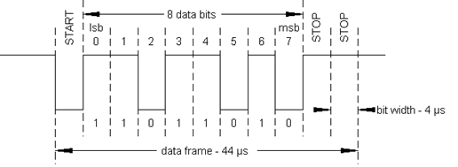
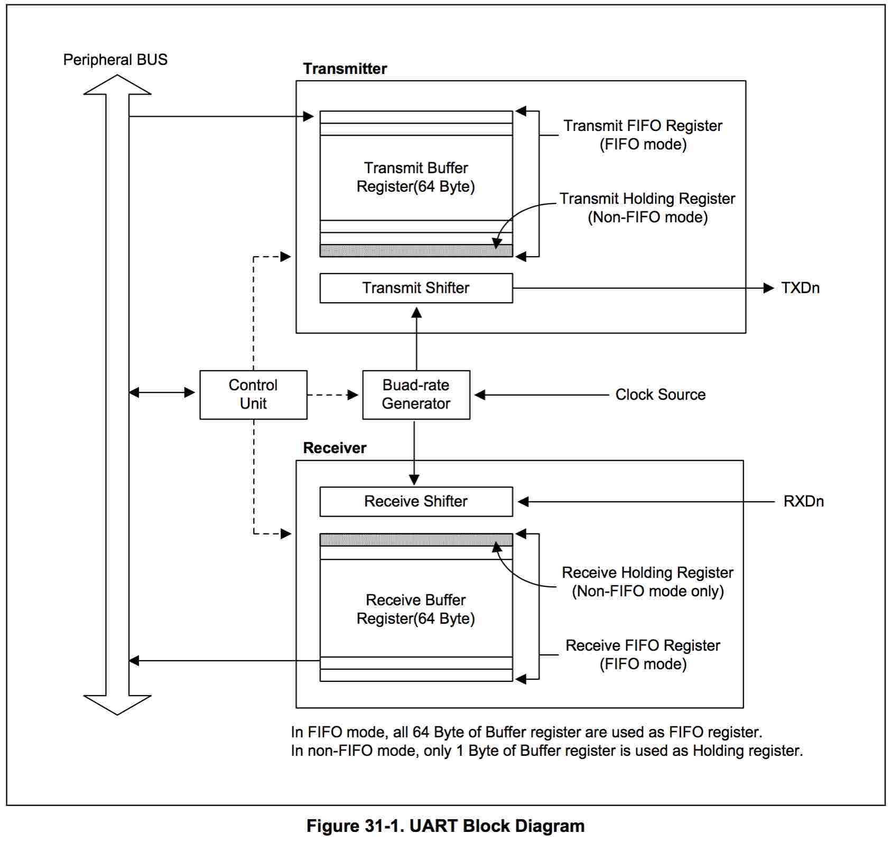

UART
=====

**通用非同步收發傳輸器**（Universal Asynchronous Receiver/Transmitter，通常稱作UART，讀音/ˈjuːart/）是一種异步收發傳輸器，是電腦硬體的一部分，將資料由串行通信與並行通信間作傳輸轉換。   
UART通常用在與其他通訊介面（如EIA RS-232）的連結上。

<https://zh.wikipedia.org/wiki/UART>
	
	UART是通用异步收发器（异步串行通信口）的英文缩写，它包括了RS232、RS449、RS423、RS422和RS485等接口标准规范和总线标准规范，即UART是异步串行通信口的总称。
	而RS232、RS449、RS423、RS422和RS485等，是对应各种异步串行通信口的接口标准和总线标准，它规定了通信口的电气特性、传输速率、连接特性和接口的机械特性等内容。实际上是属于通信网络中的物理层（最底层）的概念，与通信协议没有直接关系。而通信协议，是属于通信网络中的数据链路层（上一层）的概念。
	
	COM是PC（个人计算机）上，异步串行通信口的简写。由于历史原因，IBM的PC外部接口配置为RS232，成为实际上的PC界默认标准。所以，现在PC机的COM均为RS232。若配有多个异步串行通信口，则分别称为COM1、COM2... 。
	
####连线方式

* TxD （发送端）
* RxD （接收端）
* GND （公地端，提供参考电平）

####电气特性
UART使用标准的TTL/CMOS逻辑电平（0~5V,0~3.3V,0~1.8V等）来表示数据，高电平表示1，低电平表示0。    
为了增强数据的抗干扰能力、提高传输长度，通常将TTL/CMOS逻辑电平转换为RS-232逻辑电平（3~12V表示0，-3~-12V表示1）。

<https://zh.wikipedia.org/wiki/RS-232>

	在RS-232标准中定义了逻辑一和逻辑零电压级数，以及标准的传输速率和连接器类型。信号大小在正的和负的3－15v之间。
	RS-232规定接近零的电平是无效的，逻辑一规定为负电平，有效负电平的信号状态称为传号marking，它的功能意义为OFF，逻辑零规定为正电平，有效正电平的信号状态称为空号spacing，它的功能意义为ON。
	根据设备供电电源的不同，±5、±10、±12和±15这样的电平都是可能的。

####数据传输
UART传输以“帧”为单位。    

<https://en.wikipedia.org/wiki/Universal_asynchronous_receiver/transmitter>

帧由开始位、数据位、校验位、停止位组成。   

1. （**空闲状态**）平时数据线处于“空闲”状态（1状态）
2. （**开始位**）当要发送数据时，需要在数据位发送前，先发送一个开始位，用于通知另一端准备接收。UART发送端会改变TXD数据线的状态（由空闲的1状态变为0状态），并维持1位数据长度的时间。这样接收方一旦检测到数据线不是“空闲”状态，就开始准备接收数据。接收方等待1.5位数据长度的时间（其中1位数据长度的时间是跳过开始位，另外0.5位，保证检测到下一个数据方波的中央，防止毛刺干扰。之后检测1位数据长度时间，进行检测一次。）
3. （**传输数据**）发送完开始位，就可以一位位发送数据位。UART一帧中可以自定义有4~8位数据。发送方一位位发送，根据数据调节数据线的高低电平，实现电气传输。首先发送**最低位(LSB)**数据。
4. （**校验功能，可选**）UART发送端发送完数据以后，可以再发送一位校验码实现数据校验，防止数据发送/接收错误。分奇校验/偶校验两类。
5. （**停止位**）最后，发送停止位，用于通知接收端停止接收数据。具体做法是，将数据线恢复位“空闲”模式（1状态），并保持一定的时间（可以自定义为1位、1.5位、2位数据长度时间）

----

ARM-Tiny6410-UART
====

####端口通道
S3C6410的UART提供了四个独立的异步串行I/O(SIO)端口。（four independent asynchronous serial I/O (SIO) ports）    

####操作模式

每个异步串行I/O(SIO)端口通过**中断**或者**直接存储器存取(DMA)**模式来操作。

####传输速率
The UART can support bit rates of maximum 3Mbps.(375 KB/s)    
The baud-rate generator can be clocked by PCLK, EXT_UCLK0 or EXT_UCLK1.    
波特率发生器的时钟源可以为PCLK/EXT_UCLK0/EXT_UCLK1；

####FIFO寄存器
每个UART的通道包含了两个64字节收发FIFO存储器。

####系统架构
每个UART包含：

1. 波特率发生器（a baud-rate generator）
2. 发送器（a transmitter）
3. 接收器（a receiver）
4. 控制逻辑单元（a control unit）

* 在FIFO模式，缓冲寄存器的64字节都作为FIFO寄存器
* 在非FIFO模式，只使用缓冲寄存器的1字节作为保持寄存器（Holding Register）

####发送/接收过程

* 发送数据时，CPU先将数据写入发送FIFO中，然后UART会自动将FIFO中的数据复制到“发送移位器”（Transmit Shifter），发送移位器将数据一位一位地发送到TxD数据线上（根据设定的格式，插入开始位、校验位、停止位）。
* 接收数据时，“接收移位器”（Receive Shifter）将RxD数据线的数据一位一位读取，然后复制到接收FIFO中，CPU就可以从接收FIFO中读取数据。

###具体开发板硬件(Tiny6410)

1. 查看扩展板原理图（TinyADK-1312_sch.pdf），确定串口硬件。
		
		COM0/COM3 - SP3232芯片（串口转换芯片，TTL电平转RS232电平）
		COM0 - TXD0/RXD0
		COM3 - TXD3/RXD3

2. 查看核心板原理图（Tiny6410-1308.pdf），确定串口的引脚。

		RXD0 - XuRXD0/GPA0
		TXD0 - XuTXD0/GPA1
		
		RXD3 - XuRXD3/GPB2
		TXD3 - XuTXD3/GPB3
		
3. 查看CPU芯片手册（S3C6410X.pdf），确定对应的寄存器。

###UART配置示例（Tiny6410-COM0）

1. **设置引脚为UART功能**    
	查看CPU芯片手册，配置引脚GPA0/GPA1。
	
		GPA0 - GPACON[0:3]
		0000 = Input
		0010 = UART RXD[0] 
		0100 = Reserved 
		0110 = Reserved
		0001 = Output
		0011 = Reserved
		0101 = Reserved
		0111 = External Interrupt Group 1 [0]
	只需要配置寄存器对应位置为0x10即可。
2. **设置波特率**
	
		The value stored in the baud rate divisor register (UBRDIVn) and dividing slot register(UDIVSLOTn), are used to determine the serial Tx/Rx clock rate (baud rate) as follows:
		DIV_VAL = UBRDIVn + (num of 1’s in UDIVSLOTn)/16 DIV_VAL = (PCLK / (bps x 16 ) ) −1
		DIV_VAL = (EXT_UCLK0 / (bps x 16 ) ) −1
		or
		DIV_VAL = (EXT_UCLK1 / (bps x 16 ) ) −1

	备注：**num of 1’s in UDIVSLOTn**是指UDIVSLOTn寄存器的值有多少个位1。只要保证位1的个数相同，具体值可以不同，不影响最后结果。
	
	这里使用PCLK作为时钟源（并将PCLK配置位66.5MHZ）
	
		DIV_VAL = (PCLK / (bps x 16 ) ) - 1 = (66500000/(115200x16))-1 = 35.08
		DIV_VAL = 35.08 = UBRDIVn + (num of 1’s in UDIVSLOTn)/16
		
		因此:
		UBRDIV0   = 35;	    
		UDIVSLOT0 = 0x1;	 
		
	上式计算出来的UBRDIVn寄存器的值不一定是整数（35.08），只要其误差在1.87%之内即可。因为根据UART的要求，UART帧错误必须小于1.87%(3/160)。  
		
3. **设置传输格式**
		
	* UART LINE CONTROL REGISTER(ULCON0)
	* UART CONTROL REGISTER(UCON0)
	* UART FIFO CONTROL REGISTER(UFCON0)
	* UART MODEM CONTROL REGISTER(UMCON0)

----

### ISSUE

此文件夹的程序所编译的uart.bin，如果通过sd-no-os/的烧写方式（讲.bin文件通过dd命令烧写到SD卡的BL1区域，并配置ARM开发板为SDBOOT方式），将无法正常执行。      
而通过Friendly ARM官方提供的MiniTools.exe烧写工具，则可以正常执行。    

因为程序中的Makefile中，配置链接地址为0x5000_0000(SDRAM的地址空间)。

	arm-linux-ld -Ttext 0x50000000 -o $(OBJECT).elf $^

而程序以SDBOOT启动时，S3C6410启动后，从SD的BL1中拷贝代码到Stepping Stone中，其地址为0x0000_0000 ~ 0x07FF_FFFF;然后PC从0x0000_0000开始执行程序，即start.S代码。

查看反汇编文件：

	uart.elf:     file format elf32-littlearm

	Disassembly of section .text:

	50000000 <_start>:
	50000000:   e3a00207    mov r0, #1879048192 ; 0x70000000
	50000004:   e3800013    orr r0, r0, #19
	50000008:   ee0f0f92    mcr 15, 0, r0, cr15, cr2, {4}
	5000000c:   e59f001c    ldr r0, [pc, #28]   ; 50000030 <halt+0x4>
	50000010:   e3a01000    mov r1, #0
	50000014:   e5801000    str r1, [r0]
	50000018:   e59fd014    ldr sp, [pc, #20]   ; 	50000034 <halt+0x8>
	5000001c:   e3800a01    orr r0, r0, #4096   ; 0x1000
	50000020:   ee010f10    mcr 15, 0, r0, cr1, cr0, {0}
	50000024:   eb000015    bl  50000080 <clock_init>
	50000028:   eb000002    bl  50000038 <main>

因为程序实际在Stepping Stone中执行，很多跳转程序都会跳转到0x50000000之后的地址空间，程序就跳转到未初始化未配置的SDRAM中。

而使用MiniTools.exe，在烧写程序到SDARM前，MiniTools.exe已经配置好了SDRAM，此时烧写程序，程序运行正常。

可以看到，**链接地址的配置是非常重要的**！       
没有在对应链接地址运行的程序十分危险。因此需要**重定向**。

----
后记：   
`$ cp -r xxx/dirs/ .`   
`$ cp -r xxx/dirs .`   
这两行命令不一样啊！    
手抖多敲了一个'/'啊！   
于是readme.md文件就被覆盖掉了啊！   

	

曾经有一份写好的文档放在我面前，   
我没有备份，   
等我覆盖的时候我才后悔莫及，   
人世间最痛苦的事莫过于此。      
如果上天能够给我一个再来一次的机会，   
我会为那份文档输入三个指令：   
git pull   
git commit -m “good doc”   
git push   
如果非要在这个代码上加上一个长注释，   
我希望是...  
“天堂有路你不走，Code无涯苦作舟”  

